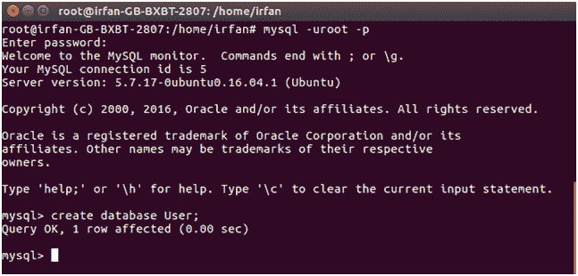
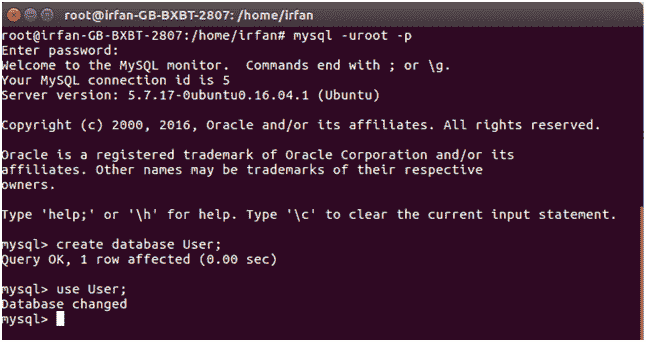
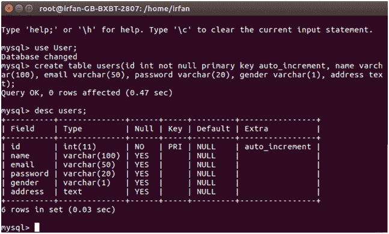
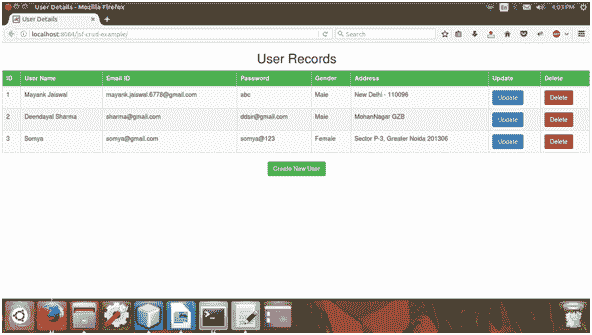
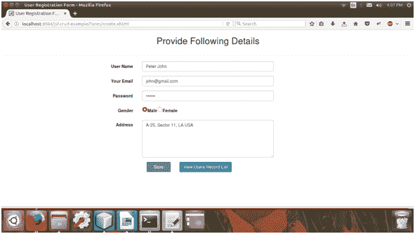
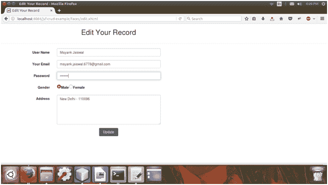
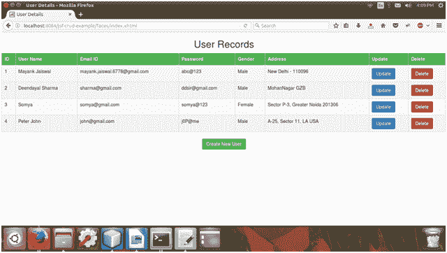
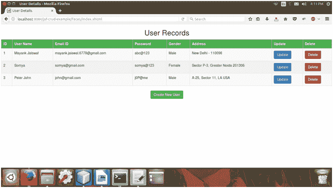

# JSF CRUD(创建读取更新删除)应用程序

> 原文:[https://www.javatpoint.com/jsf-crud-example](https://www.javatpoint.com/jsf-crud-example)

JSF 为创建应用程序提供了丰富的工具和库。这里，我们正在创建一个 CRUD 应用程序，它包括以下步骤。

* * *

## 设置数据库

1)创建数据库

```java
create database User

```



2)选择数据库

```java
use User;

```



3)创建表格

```java
create table users(id int not null primary key auto_increment, name varchar(100), 
email varchar(50), password varchar(20), gender varchar(1), address text);

```


4)查看表格结构

```java
desc users;

```



我们已经成功地创建了数据库和表。

现在，创建一个 JSF 项目，并在相应的子目录中创建以下文件。

这个例子是在 NetBean IDE 8.2 中创建的。下面是这个例子的项目结构。


* * *

// index.xhtml

```java
<!DOCTYPE html PUBLIC "-//W3C//DTD XHTML 1.0 Transitional//EN"
"http://www.w3.org/TR/xhtml1/DTD/xhtml1-transitional.dtd">
<html 
xmlns:h="http://xmlns.jcp.org/jsf/html"
xmlns:f="http://xmlns.jcp.org/jsf/core">
<h:head>
<title>User Details</title>
<h:outputStylesheet name="/css/bootstrap.min.css"/>
<style type="text/css">
table {
border-collapse: collapse;
width: 100%;
}
th, td {
text-align: left;
padding: 8px;
}

tr:nth-child(even){background-color: #f2f2f2}
th {
background-color: #4CAF50;
color: white;
}
</style>
</h:head>
<h:body>
<h:form>
<center>
<h2><h:outputText value="User Records"/></h2>
</center>
<h:dataTable binding="#{table}" value="#{user.usersList()}" var="u" 
class="table table-striped table-hover table-bordered">
<h:column>
<f:facet name="header">ID</f:facet>
<h:outputText value="#{table.rowIndex + 1}"/>
</h:column>
<h:column>
<f:facet name="header">User Name</f:facet>
<h:outputText value="#{u.name}"/>
</h:column>
<h:column>
<f:facet name="header">Email ID</f:facet>
<h:outputText value="#{u.email}"/>
</h:column>
<h:column>
<f:facet name="header">Password</f:facet>
<h:outputText value="#{u.password}"/>
</h:column>
<h:column>
<f:facet name="header">Gender</f:facet>
<h:outputText value="#{user.getGenderName(u.gender)}"/>
</h:column>
<h:column>
<f:facet name="header">Address</f:facet>
<h:outputText value="#{u.address}"/>
</h:column>
<h:column>
<f:facet name="header">Update</f:facet>
<h:commandButton action = "#{user.edit(u.id)}" value="Update" class="btn btn-primary">
</h:commandButton>
</h:column>
<h:column>
<f:facet name="header">Delete</f:facet>
<h:commandButton action = "#{user.delete(u.id)}" value="Delete" class="btn btn-danger">
</h:commandButton>
</h:column>
</h:dataTable>
<center><h:commandButton action = "create.xhtml?faces-redirect=true" 
value="Create New User" class="btn btn-success"></h:commandButton></center>
</h:form>
</h:body>
</html>

```

// create.xhtml

```java
<!DOCTYPE html PUBLIC "-//W3C//DTD XHTML 1.0 Transitional//EN"
"http://www.w3.org/TR/xhtml1/DTD/xhtml1-transitional.dtd">
<html 
xmlns:h="http://xmlns.jcp.org/jsf/html"
xmlns:f="http://xmlns.jcp.org/jsf/core">
<h:head>
<title>User Registration Form</title>
<h:outputStylesheet name="/css/bootstrap.min.css"/>
</h:head>
<h:body>
<h:form id="form" class="form-horizontal">
<div class="form-group">
<div class="col-sm-4"></div>
<div  class="col-sm-4">
<h2 style="text-align: center">Provide Following Details</h2>
</div>
</div>
<hr/>
<div class="form-group">
<h:outputLabel for="username" class="control-label col-sm-4">User Name</h:outputLabel>
<div class="col-sm-4">
<h:inputText id="name-id" value="#{user.name}" class="form-control" 
validatorMessage="User name is required">
<f:validateRequired />
</h:inputText>
</div>
</div>
<div class="form-group">
<h:outputLabel for="email" class="control-label col-sm-4">Your Email</h:outputLabel>
<div class="col-sm-4">
<h:inputText id="email-id" value="#{user.email}" class="form-control" 
validatorMessage="Email Id is required">
<f:validateRequired/>
</h:inputText>
</div>
</div>
<div class="form-group">
<h:outputLabel for="password" class="control-label col-sm-4">Password</h:outputLabel>
<div class="col-sm-4">
<h:inputSecret id="password-id" value="#{user.password}" class="form-control" 
validatorMessage="Password is required">
<f:validateRequired/>
</h:inputSecret>
</div>
</div>
<div class="form-group">
<h:outputLabel for="gender" class="control-label col-sm-4">Gender</h:outputLabel>
<div class="col-sm-4">
<h:selectOneRadio value="#{user.gender}" validatorMessage="Gender is required">
<f:selectItem itemValue="M" itemLabel="Male" />
<f:selectItem itemValue="F" itemLabel="Female" />
<f:validateRequired/>
</h:selectOneRadio>
</div>
</div>
<div class="form-group">
<h:outputLabel for="address" class="control-label col-sm-4">Address</h:outputLabel>
<div class="col-sm-4">
<h:inputTextarea value="#{user.address}" cols="50" rows="5" class="form-control" 
validatorMessage="Address is required">
<f:validateRequired/>
</h:inputTextarea>
</div>
</div>
<div class="form-group">
<div class="col-sm-4"></div>
<div class="col-sm-4">
<div class="col-sm-2">
<h:commandButton value="Save" action="#{user.save()}" class="btn btn-success" 
style="width: 80px;"></h:commandButton>
</div>
<div class="col-sm-1">
</div>
<div class="col-sm-2">
<h:link outcome="index" value="View Users Record List" class="btn btn-primary" />
</div>
</div>
</div>
</h:form>
</h:body>
</html>

```

// edit.xhtml

```java
<!DOCTYPE html PUBLIC "-//W3C//DTD XHTML 1.0 Transitional//EN"
"http://www.w3.org/TR/xhtml1/DTD/xhtml1-transitional.dtd">
<html 
xmlns:h="http://xmlns.jcp.org/jsf/html"
xmlns:f="http://xmlns.jcp.org/jsf/core">
<h:head>
<title>Edit Your Record</title>
<h:outputStylesheet name="/css/bootstrap.min.css"/>
</h:head>
<h:body>
<h:form id="form" class="form-horizontal">
<div class="form-group">
<div class="col-sm-2"></div>
<h2 style="text-align: center" class="col-sm-4">Edit Your Record</h2>
</div>
<hr/>
<div class="form-group">
<h:outputLabel for="username" class="control-label col-sm-2">User Name</h:outputLabel>
<div class="col-sm-4">
<h:inputText id="name-id" value="#{editUser.name}" class="form-control"/>
</div>
</div>
<div class="form-group">
<h:outputLabel for="email" class="control-label col-sm-2">Your Email</h:outputLabel>
<div class="col-sm-4">
<h:inputText id="email-id" value="#{editUser.email}" class="form-control"/>
</div>
</div>
<div class="form-group">
<h:outputLabel for="password" class="control-label col-sm-2">Password</h:outputLabel>
<div class="col-sm-4">
<h:inputSecret id="password-id" value="#{editUser.password}" class="form-control"/>
</div>
</div>
<div class="form-group">
<h:outputLabel for="gender" class="control-label col-sm-2">Gender</h:outputLabel>
<div class="col-sm-4">
<h:selectOneRadio value="#{editUser.gender}">
<f:selectItem itemValue="M" itemLabel="Male" />
<f:selectItem itemValue="F" itemLabel="Female" />
</h:selectOneRadio>
</div>
</div>
<div class="form-group">
<h:outputLabel for="address" class="control-label col-sm-2">Address</h:outputLabel>
<div class="col-sm-4">
<h:inputTextarea value="#{editUser.address}" cols="50" rows="5" class="form-control"/>
</div>
</div>
<div class="form-group">
<div class="col-sm-2"></div>
<div class="col-sm-4">
<center><h:commandButton value="Update" action="#{user.update(editUser)}" 
class="btn btn-primary" style="width: 80px;"></h:commandButton></center>
</div>
</div>
</h:form>
</h:body>
</html>

```

//User.java

```java
import java.sql.Connection;
import java.sql.DriverManager;
import java.sql.PreparedStatement;
import java.sql.Statement;
import java.sql.ResultSet;
import java.util.ArrayList;
import java.util.Map;
import javax.faces.bean.ManagedBean;
import javax.faces.bean.RequestScoped;
import javax.faces.context.FacesContext;
@ManagedBean
@RequestScoped
public class User{
int id;
String name;
String email;
String password;
String gender;
String address;
ArrayList usersList ;
private Map<String,Object> sessionMap = FacesContext.getCurrentInstance().getExternalContext().getSessionMap();
Connection connection;

public int getId() {
return id;
}
public void setId(int id) {
this.id = id;
}
public String getName() {
return name;
}
public void setName(String name) {
this.name = name;
}
public String getEmail() {
return email;
}
public void setEmail(String email) {
this.email = email;
}
public String getPassword() {
return password;
}
public void setPassword(String password) {
this.password = password;
}
public String getGender() {
return gender;
}
public void setGender(String gender) {
this.gender = gender;
}
public String getAddress() {
return address;
}
public void setAddress(String address) {
this.address = address;
} 
// Used to establish connection
public Connection getConnection(){
try{
Class.forName("com.mysql.jdbc.Driver");   
connection = DriverManager.getConnection( "jdbc:mysql://localhost:3306/User","root","mysql");
}catch(Exception e){
System.out.println(e);
}
return connection;
}
// Used to fetch all records
public ArrayList usersList(){
try{
usersList = new ArrayList();
connection = getConnection();
Statement stmt=getConnection().createStatement();  
ResultSet rs=stmt.executeQuery("select * from users");  
while(rs.next()){
User user = new User();
user.setId(rs.getInt("id"));
user.setName(rs.getString("name"));
user.setEmail(rs.getString("email"));
user.setPassword(rs.getString("password"));
user.setGender(rs.getString("gender"));
user.setAddress(rs.getString("address"));
usersList.add(user);
}
connection.close();        
}catch(Exception e){
System.out.println(e);
}
return usersList;
}
// Used to save user record
public String save(){
int result = 0;
try{
connection = getConnection();
PreparedStatement stmt = connection.prepareStatement(
"insert into users(name,email,password,gender,address) values(?,?,?,?,?)");
stmt.setString(1, name);
stmt.setString(2, email);
stmt.setString(3, password);
stmt.setString(4, gender);
stmt.setString(5, address);
result = stmt.executeUpdate();
connection.close();
}catch(Exception e){
System.out.println(e);
}
if(result !=0)
return "index.xhtml?faces-redirect=true";
else return "create.xhtml?faces-redirect=true";
}
// Used to fetch record to update
public String edit(int id){
User user = null;
System.out.println(id);
try{
connection = getConnection();
Statement stmt=getConnection().createStatement();  
ResultSet rs=stmt.executeQuery("select * from users where id = "+(id));
rs.next();
user = new User();
user.setId(rs.getInt("id"));
user.setName(rs.getString("name"));
user.setEmail(rs.getString("email"));
user.setGender(rs.getString("gender"));
user.setAddress(rs.getString("address"));
user.setPassword(rs.getString("password"));  
System.out.println(rs.getString("password"));
sessionMap.put("editUser", user);
connection.close();
}catch(Exception e){
System.out.println(e);
}       
return "/edit.xhtml?faces-redirect=true";
}
// Used to update user record
public String update(User u){
//int result = 0;
try{
connection = getConnection();  
PreparedStatement stmt=connection.prepareStatement(
"update users set name=?,email=?,password=?,gender=?,address=? where id=?");  
stmt.setString(1,u.getName());  
stmt.setString(2,u.getEmail());  
stmt.setString(3,u.getPassword());  
stmt.setString(4,u.getGender());  
stmt.setString(5,u.getAddress());  
stmt.setInt(6,u.getId());  
stmt.executeUpdate();
connection.close();
}catch(Exception e){
System.out.println();
}
return "/index.xhtml?faces-redirect=true";      
}
// Used to delete user record
public void delete(int id){
try{
connection = getConnection();  
PreparedStatement stmt = connection.prepareStatement("delete from users where id = "+id);  
stmt.executeUpdate();  
}catch(Exception e){
System.out.println(e);
}
}
// Used to set user gender
public String getGenderName(char gender){
if(gender == 'M'){
return "Male";
}else return "Female";
}
}

```

输出:

索引页

这是应用程序的索引页。运行项目后，它会填充 mysql 数据库用户表的结果。



### 创建页面:添加新用户记录

您可以使用此应用程序在用户表中添加新的用户记录。



添加新记录后的索引页。


### 更新用户记录

更新记录前的索引页。


### 更新表单



更新记录后的索引页



### 删除记录

删除记录前的索引页。


删除记录后的索引页



* * *

### [计] 下载

[Download this example](jsf/src/jsf-crud.zip)