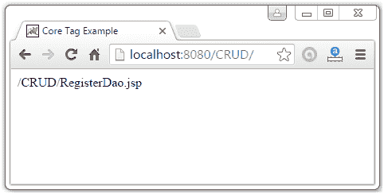

# JSTL 核心<url>标签</url>

> 原文：<https://www.javatpoint.com/jstl-core-url-tag>

标签创建一个带有可选查询参数的网址。它用于 url 编码或 url 格式化。该标记自动执行网址重写操作。

JSTL url 标记被用作编写对 response.encodeURL()方法的调用的替代方法。url 标记的优点是正确的 URL 编码，并包含由子级指定的参数。**参数**标记。

让我们看看< c:url >标签的简单例子:

```java

Core Tag Example

```

输出:

```java
/CRUD/RegisterDao.jsp

```

**注意:** CRUD 是我的项目名换句话说就是 JSP 应用程序名。

