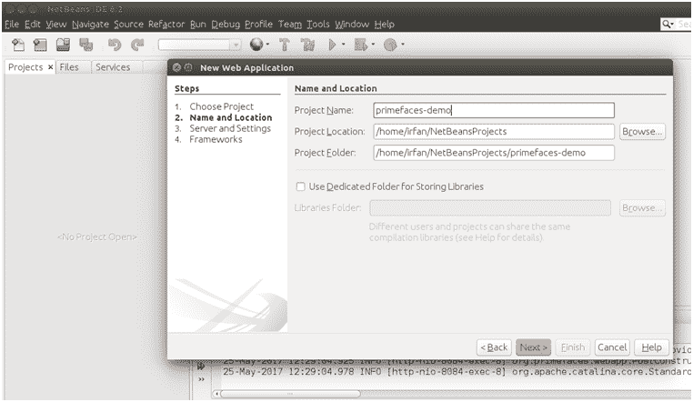
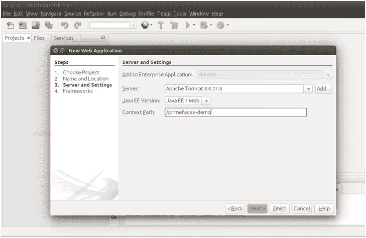
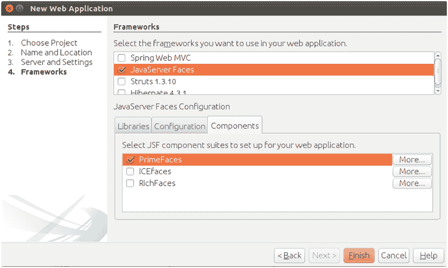
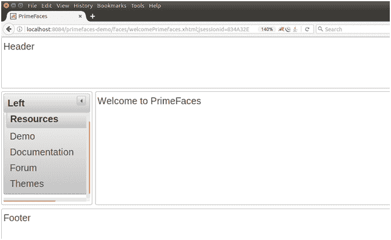

# 素数面配置

> 原文：<https://www.javatpoint.com/primefaces-configuration>

### 下载 JAR

要在我们的 JSF 应用程序中配置 primeface，我们只需要下载一个 JAR 文件**primeface-{ version }。罐子**。我们可以从 primfaces 的官方网站手动下载。

如果我们想在 maven 项目中使用它，我们可以在我们的 **pom.xml** 文件中添加以下依赖项。

```java

<dependency>
	<groupId>org.primefaces</groupId>
	<artifactId>primefaces</artifactId>
	<version>6.1</version>
</dependency>

```

#### 注意:在 NetBeans IDE 中，默认情况下包含 primefaces。我们不需要手动下载。

### 先决条件

强制依赖:这些是执行应用程序所必需的。

**Java** - Java 6 或更高版本

**JSF** - JSF 2.0 或更高

**可选依赖项:**这些不是必需的，但可以用来获取自定义特征。

| 属国 | 描述 |
| commons-fileupload、commons-io | 它用于上传文件。 |
| 空气 | 它用于推送支持。 |
| 条形码 4j-灯 | 它用于条形码。 |
| itext | 用于导出 PDF 文档。 |

添加依赖项后，让我们创建一个应用程序。该示例包括以下步骤。

### 创建项目


提供项目名称。



选择服务器和 J2EE 版本。



选择框架 JSF 和 primeface 库。



点击完成，它将创建一个网络应用程序。项目结构如下所示:


本项目包含默认 **index.xhtml** 文件。运行该索引文件后，它会产生以下输出。


这个页面被重定向到 **welcomePrimefaces.xhtml** ，产生如下输出:

