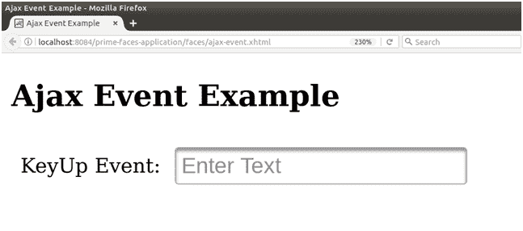
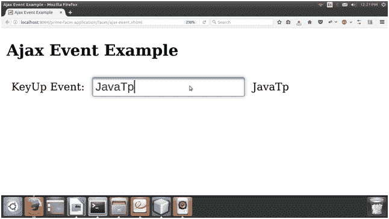

# PrimeFaces Ajax 事件

> 原文：<https://www.javatpoint.com/primefaces-ajax-event>

此属性用于触发指定方法上的事件。我们可以在这个属性中传递 onclick、keyup 等事件。

输入组件的默认客户端事件是 onchange。我们可以使用事件属性覆盖它。在下面的例子中，当键在输入字段上时，Ajax 请求被触发。

### JSF 档案

**// ajax-event.xhtml**

```java

<?xml version='1.0' encoding='UTF-8' ?>
<!DOCTYPE html PUBLIC "-//W3C//DTD XHTML 1.0 Transitional//EN""http://www.w3.org/TR/xhtml1/DTD/xhtml1-transitional.dtd">
<html 
xmlns:h="http://xmlns.jcp.org/jsf/html"
xmlns:p="http://primefaces.org/ui">
<h:head>
<title>Ajax Event Example</title>
</h:head>
<h:body>
<h2>Ajax Event Example</h2>
<h:form>
<h:panelGrid columns="3" cellpadding="5">
<h:outputText value="KeyUp Event: " />
<p:inputText id="firstname" value="#{user.name}" placeholder="Enter Text">
<p:ajax event="keyup" update="out" />
</p:inputText>
<h:outputText id="out" value="#{user.name}" />
</h:panelGrid>
</h:form>
</h:body>
</html>

```

### 托管 Bean

**//User.java**

```java

package com.javatpoint;
import java.io.Serializable;
import javax.faces.bean.ManagedBean;
@ManagedBean
public class User implements Serializable{
String name;
String lastName;
public String getName() {
return name;
}
public void setName(String name) {
this.name = name;
}   
public String getLastName() {
return lastName;
}
public void setLastName(String lastName) {
this.lastName = lastName;
}

}

```

输出:



输入值后，Ajax 事件触发并提供以下输出:

