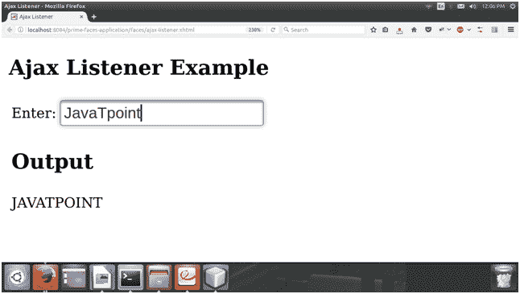

# PrimeFaces Ajax 侦听器

> 原文:[https://www.javatpoint.com/primefaces-ajax-listener](https://www.javatpoint.com/primefaces-ajax-listener)

该属性用于通过使用 Ajax 请求来调用 Java 方法。它是 **<的一个属性:ajax >** 组件。

这里，我们正在创建一个从 ManagedBean 调用方法的示例。它包括以下文件和代码。

### JSF 档案

**// ajax-listener.xhtml**

```java

<?xml version='1.0' encoding='UTF-8' ?>
<!DOCTYPE html PUBLIC "-//W3C//DTD XHTML 1.0 Transitional//EN""http://www.w3.org/TR/xhtml1/DTD/xhtml1-transitional.dtd">
<html 
xmlns:h="http://xmlns.jcp.org/jsf/html"
xmlns:p="http://primefaces.org/ui">
<h:head>
<title>Ajax Listener</title>
</h:head>
<h:body>
<h2>Ajax Listener Example</h2>
<h:form>
<h:panelGrid columns="3">
<h:outputText value="Enter: " />
<p:inputText id="counter" value="#{listenerBean.text}" placeholder="Enter Text">
<p:ajax event="keyup" update="out" listener="#{listenerBean.ajaxEvent()}" />
</p:inputText>
</h:panelGrid>
<h:panelGrid id="out">
<h2>Output</h2>
<h:outputText value="#{listenerBean.text}" />
</h:panelGrid>
</h:form>
</h:body>
</html>

```

### 托管 Bean

**//ListenerBean.java**

```java

package com.javatpoint;
import javax.faces.bean.ManagedBean;
@ManagedBean
public class ListenerBean {
String text;
public String getText() {
return text;
}
public void setText(String text) {
this.text = text;
}
public void ajaxEvent() {
text = text.toUpperCase();
}
}

```

输出:


它将调用将输入值转换为大写的 Java 方法。

