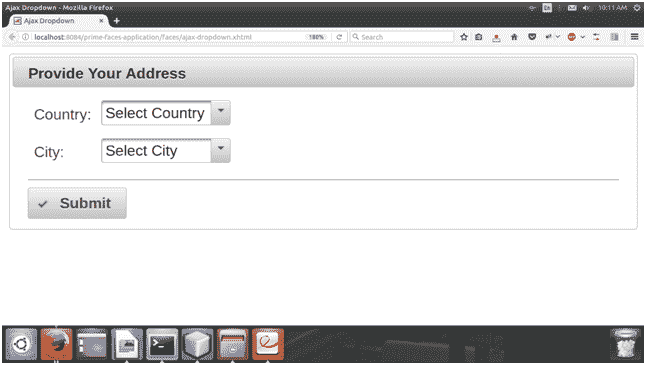
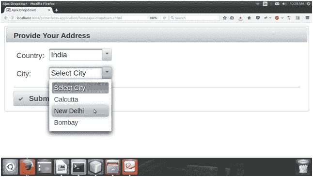

# PrimeFaces Ajax 下拉列表

> 原文:[https://www.javatpoint.com/primefaces-ajax-dropdown](https://www.javatpoint.com/primefaces-ajax-dropdown)

PrimeFaces 提供了一种基于过滤器创建动态下拉列表的简单方法。Ajax 调用形成了一个新的下拉列表。每个事件发生后， **< p:ajax >** 标记调用 Java 方法。

在下面的例子中，我们创建了两个下拉列表。该示例包括以下文件。

### JSF 档案

**// ajax-dropdown.xhtml**

```java

<?xml version='1.0' encoding='UTF-8' ?>
<!DOCTYPE html PUBLIC "-//W3C//DTD XHTML 1.0 Transitional//EN""http://www.w3.org/TR/xhtml1/DTD/xhtml1-transitional.dtd">
<html 
xmlns:h="http://xmlns.jcp.org/jsf/html"
xmlns:p="http://primefaces.org/ui"
xmlns:f="http://xmlns.jcp.org/jsf/core">
<h:head>
<title>Ajax Dropdown</title>
</h:head>
<h:body>
<h:form>
<p:growl id="msgs" showDetail="true" />
<p:panel header="Provide Your Address" style="margin-bottom:10px;">
<h:panelGrid columns="2" cellpadding="5">
<p:outputLabel for="country" value="Country: " />
<p:selectOneMenu id="country" value="#{dropdown.country}" style="width:150px">
<p:ajax listener="#{dropdown.onCountryChange}" update="city" />
<f:selectItem itemLabel="Select Country" itemValue="" noSelectionOption="true" />
<f:selectItems value="#{dropdown.countries}" />
</p:selectOneMenu>
<p:outputLabel for="city" value="City: " />
<p:selectOneMenu id="city" value="#{dropdown.city}" style="width:150px">
<f:selectItem itemLabel="Select City" itemValue="" noSelectionOption="true" />
<f:selectItems value="#{dropdown.cities}" />
</p:selectOneMenu>
</h:panelGrid>
<p:separator />
<p:commandButton value="Submit" update="msgs" actionListener="#{dropdown.displayLocation}" icon="ui-icon-check" />
</p:panel>
</h:form>
</h:body>
</html>

```

### ManagedBean

**//Dropdown.java**

```java

package com.javatpoint;
import java.io.Serializable;
import java.util.HashMap;
import java.util.Map;
import javax.annotation.PostConstruct;
import javax.faces.application.FacesMessage;
import javax.faces.bean.ManagedBean;
import javax.faces.bean.ViewScoped;
import javax.faces.context.FacesContext;
@ManagedBean
@ViewScoped
public class Dropdown implements Serializable {
private final Map<String,Map<String,String>> data = new HashMap<>();
private String country; 
private String city;  
private Map<String,String> countries;
private Map<String,String> cities;
@PostConstruct
public void init() {
countries  = new HashMap<>();
countries.put("USA", "USA");
countries.put("India", "India");
countries.put("Russia", "Russia");
Map<String,String> map = new HashMap<>();
map.put("New York", "New York");
map.put("San Francisco", "San Francisco");
map.put("Denver", "Denver");
data.put("USA", map);
map = new HashMap<>();
map.put("New Delhi", "New Delhi");
map.put("Bombay", "Bombay");
map.put("Calcutta", "Calcutta");
data.put("India", map);
map = new HashMap<>();
map.put("Moscow", "Moscow");
map.put("Saint Petersburg", "Saint Petersburg");
map.put("Samara", "Samara");
data.put("Russia", map);
}
public Map<String, Map<String, String>> getData() {
return data;
}
public String getCountry() {
return country;
}
public void setCountry(String country) {
this.country = country;
}
public String getCity() {
return city;
}
public void setCity(String city) {
this.city = city;
}
public Map<String, String> getCountries() {
return countries;
}
public Map<String, String> getCities() {
return cities;
}
public void onCountryChange() {
if(country !=null && !country.equals(""))
cities = data.get(country);
else
cities = new HashMap<>();
}
public void displayLocation() {
FacesMessage msg;
if(city != null && country != null)
msg = new FacesMessage("Selected", city + " of " + country);
else
msg = new FacesMessage(FacesMessage.SEVERITY_ERROR, "Invalid", "City is not selected."); 
FacesContext.getCurrentInstance().addMessage(null, msg);  
}
}
package com.javatpoint;
import java.io.Serializable;
import java.util.HashMap;
import java.util.Map;
import javax.annotation.PostConstruct;
import javax.faces.application.FacesMessage;
import javax.faces.bean.ManagedBean;
import javax.faces.bean.ViewScoped;
import javax.faces.context.FacesContext;
@ManagedBean
@ViewScoped
public class Dropdown implements Serializable {
private final Map<String,Map<String,String>> data = new HashMap<>();
private String country; 
private String city;  
private Map<String,String> countries;
private Map<String,String> cities;
@PostConstruct
public void init() {
countries  = new HashMap<>();
countries.put("USA", "USA");
countries.put("India", "India");
countries.put("Russia", "Russia");
Map<String,String> map = new HashMap<>();
map.put("New York", "New York");
map.put("San Francisco", "San Francisco");
map.put("Denver", "Denver");
data.put("USA", map);
map = new HashMap<>();
map.put("New Delhi", "New Delhi");
map.put("Bombay", "Bombay");
map.put("Calcutta", "Calcutta");
data.put("India", map);
map = new HashMap<>();
map.put("Moscow", "Moscow");
map.put("Saint Petersburg", "Saint Petersburg");
map.put("Samara", "Samara");
data.put("Russia", map);
}
public Map<String, Map<String, String>> getData() {
return data;
}
public String getCountry() {
return country;
}
public void setCountry(String country) {
this.country = country;
}
public String getCity() {
return city;
}
public void setCity(String city) {
this.city = city;
}
public Map<String, String> getCountries() {
return countries;
}
public Map<String, String> getCities() {
return cities;
}
public void onCountryChange() {
if(country !=null && !country.equals(""))
cities = data.get(country);
else
cities = new HashMap<>();
}
public void displayLocation() {
FacesMessage msg;
if(city != null && country != null)
msg = new FacesMessage("Selected", city + " of " + country);
else
msg = new FacesMessage(FacesMessage.SEVERITY_ERROR, "Invalid", "City is not selected."); 
FacesContext.getCurrentInstance().addMessage(null, msg);  
}
}

```

执行后，它会产生以下输出。

输出:



第二个下拉列表包含每个国家的城市名称。每次选择国家时，城市都会动态更新。


