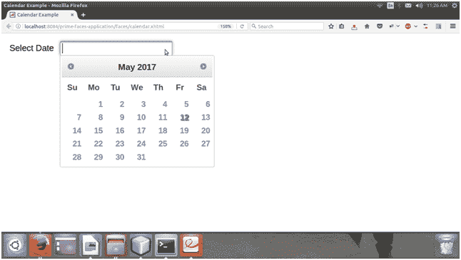
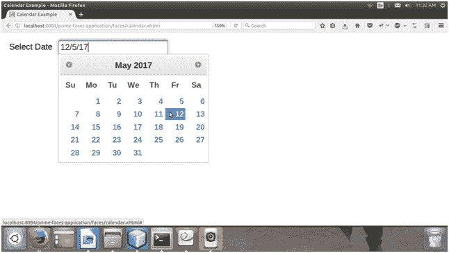

# primefaces 日历

> 原文:[https://www.javatpoint.com/primefaces-calendar](https://www.javatpoint.com/primefaces-calendar)

它是用于选择日期的输入组件。在 JSF 应用程序中，使用 **< p:calendar >** 组件创建日历。它包括各种功能，如:显示模式、分页、本地化、ajax 选择等。

日历的值应该是一个 **java.util.Date.**

## 日历属性

下表包含日历组件的属性。

| 属性 | 缺省值 | 返回类型 | 描述 |
| 编号 | 空 | 线 | 它是组件的唯一标识符。 |
| 提供 | 真实的 | 布尔代数学体系的 | 它使用布尔值来指定组件的呈现。 |
| 价值 | 空 | java.util.Date | 它用于设置组件的值。 |
| 转换器 | 空 | 转换器/字符串 | 它采用一个表达式或文字文本来定义组件的转换器。 |
| 需要 | 错误的 | 布尔代数学体系的 | 它用于根据需要制作组件。 |
| 最小日期 | 错误的 | 日期或字符串 | 它用于设置日历的最小可见日期。 |
| 最大日期 | 空 | 日期或字符串 | 它用于设置日历的最大可见日期。 |
| 页 | one | 整数 | 它支持多页面呈现。 |
| 方式 | 弹出 | 线 | 它用于定义日历的显示方式。 |
| 模式 | 月/日/年 | 线 | 它用于设置本地化的日期格式模式。 |
| 时区 | 空 | 时区 | 它用于指定用于日期转换的时区。 |
| 展示周 | 错误的 | 布尔代数学体系的 | 用于显示每周旁边的周数。 |
| 禁用的周末 | 错误的 | 布尔代数学体系的 | 它禁用周末栏。 |
| 显示其他月份 | 错误的 | 布尔代数学体系的 | 它显示属于其他月份的日期。 |
| 选择其他月份 | 错误的 | 布尔代数学体系的 | 它允许选择属于其他月份的日期。 |
| 重新整理 | 空 | 线 | 用于设置年份范围。 |
| 只有时间 | 错误的 | 布尔代数学体系的 | 它只显示时间选择器，没有日期。 |

## 纺纱

下表包含结构样式类。

| 样式类 | 适用 |
| .ui-datepicker | 它用于主容器。 |
| .ui-datepicker-header | 它用于标题容器。 |
| 。ui 日期选择器-预测 | 它用于前一个月的导航器。 |
| 。ui-日期选择器-下一步 | 它用于下个月的导航。 |
| .ui-datepicker-title | 它用于标题。 |
| 。ui-日期选择器-月份 | 它用于月份显示。 |
| 。ui date picker 表 | 它用于日期表。 |
| 。ui-日期选择器-周末 | 此类用于周末标签。 |
| 。ui-日期选择器-其他月 | 属于其他月份的日期的类。 |
| .ui-datepicker td | 它用于每个单元格日期。 |
| 。ui date picker button pane | 这是按钮面板类。 |
| 。ui-date picker-当前 | 这个类用于今日按钮。 |
| 。ui-日期选择器-关闭 | 用于显示关闭按钮。 |

* * *

## 例子

这里，在下面的例子中，我们正在实现 **< p:calendar >** 组件。本示例包含以下文件。

### JSF 档案

**// calendar.xhtml**

```java

<?xml version='1.0' encoding='UTF-8' ?>
<!DOCTYPE html PUBLIC "-//W3C//DTD XHTML 1.0 Transitional//EN""http://www.w3.org/TR/xhtml1/DTD/xhtml1-transitional.dtd">
<html 
xmlns:h="http://xmlns.jcp.org/jsf/html"
xmlns:p="http://primefaces.org/ui">
<h:head>
<title>Calendar Example</title>
</h:head>
<h:body>
<h:panelGrid columns="2" cellpadding="5">
<p:outputLabel for="inline" value="Select Date" />
<p:calendar id="inline" value="#{calendar.date}" mode="popup" />
</h:panelGrid>
</h:body>
</html>

```

### ManagedBean

**//Calendar.java**

```java

package com.javatpoint;
import java.text.SimpleDateFormat;
import java.util.Date;
import javax.faces.application.FacesMessage;
import javax.faces.bean.ManagedBean;
import javax.faces.context.FacesContext;
import org.primefaces.context.RequestContext;
import org.primefaces.event.SelectEvent;
@ManagedBean
public class Calendar {
private Date date;
public void onDateSelect(SelectEvent event) {
FacesContext facesContext = FacesContext.getCurrentInstance();
SimpleDateFormat format = new SimpleDateFormat("dd/MM/yyyy");
facesContext.addMessage(null, new FacesMessage(FacesMessage.SEVERITY_INFO, "Date Selected", format.format(event.getObject())));
}
public void click() {
RequestContext requestContext = RequestContext.getCurrentInstance();
requestContext.update("form:display");
requestContext.execute("PF('dlg').show()");
}
public Date getDate() {
return date;
}
public void setDate(Date date) {
this.date = date;
}
}

```

运行 JSF 文件后，它会产生以下输出。

输出:



它显示信息，当我们检查它时，如下所示。

