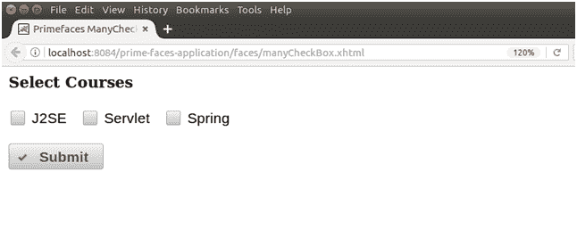
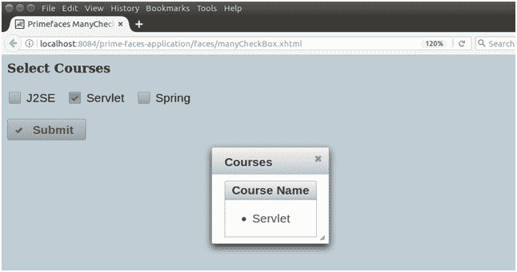

# 素数面选择多个复选框

> 原文：<https://www.javatpoint.com/primefaces-selectmanycheckbox>

它用于从给定选项中选择多个值。当我们想要从一个集合中获取多个用户输入时，它非常有用。我们可以使用**<p:selectManyCheckbox>**组件在 JSF 应用程序中创建 selectManyCheckbox。

下面列出了它的各种属性。

## 许多按钮属性

| 属性 | 缺省值 | 返回类型 | 描述 |
| 编号 | 空 | 线 | 它是组件的唯一标识符。 |
| 提供 | 真实的 | 布尔代数学体系的 | 它用于指定组件的呈现。 |
| 价值 | 空 | 对象 | 它用于设置组件的值。 |
| 需要 | 错误的 | 布尔代数学体系的 | 它用于根据需要标记组件。 |
| 所需消息 | 空 | 线 | 它用于设置当必填字段验证失败时要显示的消息。 |
| 有缺陷的 | 错误的 | 布尔代数学体系的 | 它用于禁用组件。 |
| 标签 | 空 | 线 | 它用于设置用户可表示的名称。 |
| 布局 | linedireaction | 线 | 它用于设置复选框的布局。 |
| 列 | Zero | 整数 | 它用于指定网格布局中的列数。 |
| 昂哥 | 空 | 线 | 它用于在值更改时执行脚本。 |
| 风格 | 空 | 线 | 用于设置组件的内联 CSS。 |
| tab 键索引 | 空 | 线 | 它用于设置组件在跳转顺序中的位置。 |

* * *

## 纺纱

下表包含 SelectManyCheckbox 的结构样式类。

| 样式类 | 适用 |
| . ui-selectmanycheckbox | 它适用于主容器元素。 |
| 。ui 检查盒 | 它适用于复选框的容器。 |
| 。ui 自动取款机 | 它适用于复选框图标的容器。 |
| 。ui 检查框图标 | 它适用于复选框图标。 |

## 例子

这里，在下面的例子中，我们正在实现**<p:selectManyCheckbox>**组件。本示例包含以下文件。

### JSF 档案

**//SelectManyCheckbox . XHTML**

```java
<?xml version='1.0' encoding='UTF-8' ?>
<!DOCTYPE html PUBLIC "-//W3C//DTD XHTML 1.0 Transitional//EN""http://www.w3.org/TR/xhtml1/DTD/xhtml1-transitional.dtd">
<html 
xmlns:h="http://xmlns.jcp.org/jsf/html"
xmlns:p="http://primefaces.org/ui"
xmlns:f="http://xmlns.jcp.org/jsf/core">
<h:head>
<title>Primefaces ManyCheckBox</title>
</h:head>
<h:body>
<h:form>
<h3 style="margin-top:0px">Select Courses</h3>
<p:selectManyCheckbox id="basic" value="#{manyCheckBox.selectedCourse}">
<f:selectItem itemLabel="J2SE" itemValue="J2SE" />
<f:selectItem itemLabel="Servlet" itemValue="Servlet" />
<f:selectItem itemLabel="Spring" itemValue="Spring" />
</p:selectManyCheckbox>
<br/>
<p:commandButton value="Submit" update="display-courses" oncomplete="PF('dlg').show()" icon="ui-icon-check" />
<p:dialog header="Courses" modal="true" showEffect="clip" widgetVar="dlg" resizable="true">
<p:outputPanel id="display-courses">
<p:dataList value="#{manyCheckBox.selectedCourse}" var="example">
<f:facet name="header">
Course Name
</f:facet>
#{example}
</p:dataList>
</p:outputPanel>
</p:dialog>
</h:form>
</h:body>
</html>

```

### ManagedBean

**//ManyCheckBox.java**

```java
package com.javatpoint;
import javax.faces.bean.ManagedBean;
@ManagedBean
public class ManyCheckBox {
private String[] selectedCourse;
public String[] getSelectedCourse() {
return selectedCourse;
}
public void setSelectedCourse(String[] selectedCourse) {
this.selectedCourse = selectedCourse;
}
}

```

输出:

 