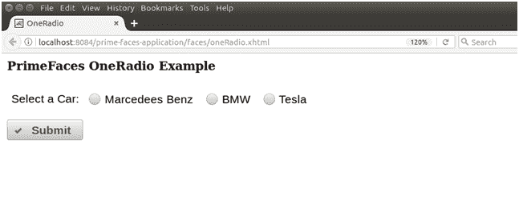
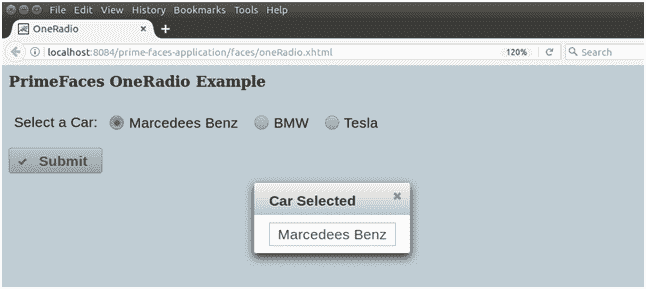

# PrimeFaces SelectOneRadio

> 原文:[https://www.javatpoint.com/primefaces-selectoneradio](https://www.javatpoint.com/primefaces-selectoneradio)

它用于从选项列表中选择一个项目。这是一个带有主题集成的扩展版本。**<p:select one 单选>** 组件用于创建单选按钮列表。当我们需要用户的单一输入时，它非常有用。它具有以下列出的各种属性。

## 选择一个无线电属性

| 属性 | 缺省值 | 类型 | 描述 |
| 编号 | 空 | 线 | 它是组件的唯一标识符。 |
| 提供 | 真实的 | 布尔代数学体系的 | 它用于指定组件的呈现。 |
| 价值 | 空 | 目标 | 它用于设置引用列表的组件的值。 |
| 需要 | Zero | 布尔代数学体系的 | 它用于根据需要标记组件。 |
| valueChangeListener | 空 | MethodExpr | 它用于引用处理值更改事件的方法。 |
| converterMessage | 空 | 线 | 用于设置转换失败时显示的消息。 |
| 有缺陷的 | 错误的 | 布尔代数学体系的 | 它用于禁用组件。 |
| 标签 | 空 | 线 | 它用于设置组件的标签。 |
| 布局 | 线路方向 | 线 | 用于设置单选按钮的布局。 |
| 列 | Zero | 整数 | 用于设置网格布局中的列数。 |
| 昂哥 | 空 | 线 | 它用于在值更改时执行方法。 |
| 风格 | 空 | 线 | 用于设置组件的内联 CSS。 |
| tab 键索引 | 空 | 线 | 它指定选项卡导航中元素的选项卡顺序。 |
| 平原 | 错误的 | 布尔代数学体系的 | 它显示单选按钮的普通模式。 |

## 例子

这里，在下面的例子中，我们正在实现 **< p:selectOneRadio >** 组件。本示例包含以下文件。

### JSF 档案

**// oneRadio.xhtml**

```java

<?xml version='1.0' encoding='UTF-8' ?>
<!DOCTYPE html PUBLIC "-//W3C//DTD XHTML 1.0 Transitional//EN""http://www.w3.org/TR/xhtml1/DTD/xhtml1-transitional.dtd">
<html 
xmlns:h="http://xmlns.jcp.org/jsf/html"
xmlns:p="http://primefaces.org/ui"
xmlns:f="http://xmlns.jcp.org/jsf/core">
<h:head>
<title>OneRadio</title>
</h:head>
<h:body>
<h:form>
<h3 style="margin-top:0">PrimeFaces OneRadio Example</h3>
<h:panelGrid columns="2" style="margin-bottom:10px" cellpadding="5">
<p:outputLabel value="Select a Car:" />
<p:selectOneRadio id="car" value="#{oneRadio.car}">
<f:selectItem itemLabel="Marcedees Benz" itemValue="Marcedees Benz" />
<f:selectItem itemLabel="BMW" itemValue="BMW" />
<f:selectItem itemLabel="Tesla" itemValue="Tesla" />
</p:selectOneRadio>
</h:panelGrid>
<p:commandButton value="Submit" update="display" icon="ui-icon-check" oncomplete="PF('dlg').show()"/>
<p:dialog modal="true" resizable="false" widgetVar="dlg" header="Car Selected" showEffect="clip">
<p:panelGrid columns="2" id="display" columnClasses="label,value">
<h:outputText value="#{oneRadio.car}" />
</p:panelGrid>
</p:dialog>
</h:form>
</h:body>
</html>

```

### ManagedBean

【t0///一个收音机. Java】t1

```java

package com.javatpoint;
import javax.faces.bean.ManagedBean;
@ManagedBean
public class OneRadio {
private String car;
public String getCar() {
return car;
}
public void setCar(String car) {
this.car = car;
}
}

```

输出:


