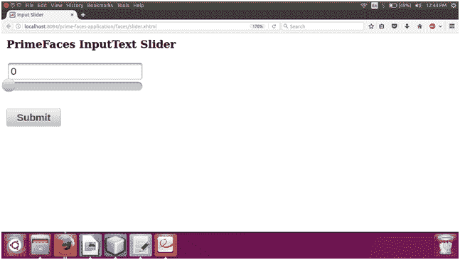
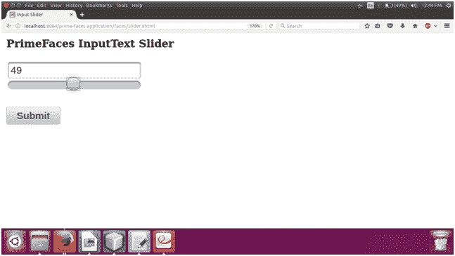

# 素数面滑块

> 原文:[https://www.javatpoint.com/primefaces-slider](https://www.javatpoint.com/primefaces-slider)

这是一个带滑块的文本输入。它用于在滑块的帮助下获取用户输入。它允许我们通过使用滑块来增加和减少输入。 **< p:滑块>** 组件用于创建滑块输入文本。下面列出了它的各种属性。

## 滑块属性

| 属性 | 缺省值 | 类型 | 描述 |
| 最小值 | Zero | 整数 | 它用于设置滑块的最小值。 |
| 最大值 | One hundred | 整数 | 它用于设置滑块的最大值。 |
| 风格 | 空 | 线 | 它用于设置容器元素的内联 CSS。 |
| 有生命的 | 真实的 | 布尔代数学体系的 | 设置动画特征的启用或禁用需要布尔值。 |
| 类型 | 水平的 | 线 | 它用于设置滑块的类型。无论是水平还是垂直。 |
| 步骤 | one | 整数 | 它用于设置滑块的步长。 |
| 有缺陷的 | Zero | 布尔代数学体系的 | 它用于禁用滑块。它需要布尔值。 |
| onSlideStart | 空 | 线 | 它用于在滑块启动事件上调用客户端脚本。 |
| onSlideEnd | 空 | 线 | 它在幻灯片末端执行客户端脚本。 |
| 范围 | 错误的 | 布尔代数学体系的 | 它用于提供范围。 |
| 显示模板 | 空 | 线 | 它是一个字符串模板。 |

## 例子

这里，在下面的例子中，我们正在实现 **< p:滑块>** 组件。本示例包含以下文件。

### JSF 档案

**// slider.xhtml**

```java

<?xml version='1.0' encoding='UTF-8' ?>
<!DOCTYPE html PUBLIC "-//W3C//DTD XHTML 1.0 Transitional//EN""http://www.w3.org/TR/xhtml1/DTD/xhtml1-transitional.dtd">
<html 
xmlns:h="http://xmlns.jcp.org/jsf/html"
xmlns:p="http://primefaces.org/ui">
<h:head>
<title>Input Slider</title>
</h:head>
<h:body>
<h:form>
<p:growl id="growl" showDetail="true" />
<h3 style="margin-top: 0">PrimeFaces InputText Slider</h3>
<h:panelGrid columns="1" style="margin-bottom: 10px">
<p:inputText id="user-name" value="#{slider.value}" />
<p:slider for="user-name" />
</h:panelGrid>
<br/>
<p:commandButton value="Submit" />
</h:form>
</h:body>
</html>

```

### ManagedBean

**//Slider.java**

```java

package com.javatpoint;
import javax.faces.bean.ManagedBean;
@ManagedBean
public class Slider {
private int value;
public int getValue() {
return value;
}
public void setValue(int value) {
this.value = value;
}
}

```

输出:


