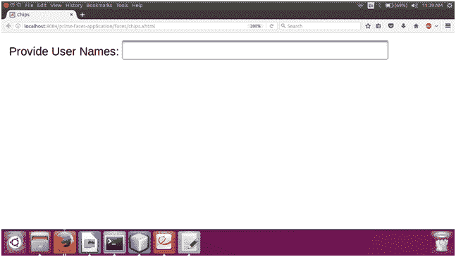
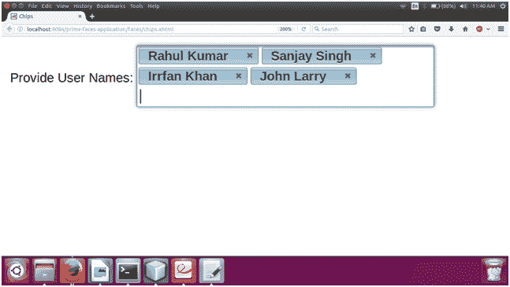

# PrimeFaces 芯片

> 原文：<https://www.javatpoint.com/primefaces-chips>

这是一个输入文本框，用于输入多个值。在 JSF 应用程序中， **< p:chips >** 组件用于创建输入文本。当我们想通过使用单个组件从用户那里获取多个值时，这很有用。下面列出了它的各种属性。

## 芯片属性

| 属性 | 缺省值 | 类型 | 描述 |
| 提供 | 真实的 | 布尔代数学体系的 | 它用于指定渲染组件。 |
| 价值 | 空 | 目标 | 它用于设置组件的值。 |
| 需要 | 错误的 | 布尔代数学体系的 | 它用于根据需要标记组件。 |
| 验证器 | 空 | MethodExpr | 它用于为组件设置验证器。 |
| valueChangeListener | 空 | 值更改侦听器 | 它用于设置 valuechangelistener。 |
| 所需消息 | 空 | 线 | 它用于设置当必填字段验证失败时要显示的消息。 |
| converterMessage | 空 | 线 | 用于设置转换失败时显示的消息。 |
| validastormessage | 空 | 线 | 它用于设置验证字段时要显示的消息。 |
| widgetVar | 空 | 线 | 它用于设置客户端小部件的名称。 |
| 最大 | 空 | 整数 | 它用于设置允许的最大条目数。 |

## 例子

这里，在下面的例子中，我们正在实现 **< p:chips >** 组件。本示例包含以下文件。

### JSF 档案

**// chips.xhtml**

```java

<?xml version='1.0' encoding='UTF-8' ?>
<!DOCTYPE html PUBLIC "-//W3C//DTD XHTML 1.0 Transitional//EN""http://www.w3.org/TR/xhtml1/DTD/xhtml1-transitional.dtd">
<html 
xmlns:h="http://xmlns.jcp.org/jsf/html"
xmlns:p="http://primefaces.org/ui">
<h:head>
<title>Chips</title>
</h:head>
<h:body>
<h:panelGrid columns="2">
<p:outputLabel for="username" value="Provide User Names:  " />
<p:chips id="username" />
</h:panelGrid>
</h:body>
</html>

```

输出:


