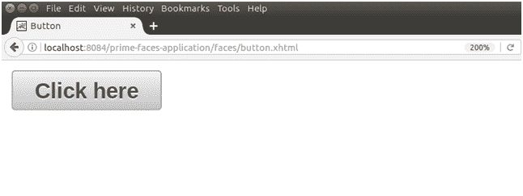

# PrimeFaces 按钮

> 原文：<https://www.javatpoint.com/primefaces-button>

它是标准 **h:button** JSF 组件的扩展，具有高级蒙皮功能。它用于在网络上发送 GET 请求。 **< p:按钮>** 组件用于在 JSF 应用程序中创建按钮。它具有以下属性。

## 按钮属性

| 属性 | 缺省值 | 类型 | 描述 |
| 提供 | 真实的 | 布尔代数学体系的 | 它使用布尔值来指定组件的呈现。 |
| 价值 | 空 | 目标 | 它用于设置组件的值。 |
| 结果 | 空 | 线 | 它用于解决导航案例。 |
| 包括视图参数 | 错误的 | 布尔代数学体系的 | 是否在目标 URI 中包含页面参数 |
| 碎片 | 空 | 线 | 应该滚动到的目标页面的标识符。 |
| 有缺陷的 | 错误的 | 布尔代数学体系的 | 它禁用了按钮。 |
| 访问密钥 | 空 | 线 | 它指定按下时将焦点转移到按钮的访问键。 |
| 目录 | 空 | 线 | 它为不继承方向性的文本提供方向指示。 |
| 图像 | 空 | 线 | 这是按钮图标的样式类。 |
| 语言 | 空 | 线 | 它用于指定语言。 |
| tab 键索引 | 空 | 整数 | 它用于设置跳转顺序中的位置。 |
| 标题 | 空 | 线 | 它提供咨询工具提示信息。 |
| 超链接 | 空 | 线 | 它用于直接链接资源以实现锚定行为。 |
| 图标 | 空 | 线 | 按钮图标。 |
| iconos | 左边的 | 线 | 它提供按钮图标的位置。 |
| 目标 | _self | 线 | 窗口目标。 |
| 逃跑 | 真实的 | 布尔代数学体系的 | 它定义标签是否会被转义。 |
| disableclientwinsow | 错误的 | 布尔代数学体系的 | 禁止追加客户端窗口。 |

## 例子

这里，在下面的例子中，我们正在实现 **< p:button >** 组件。本示例包含以下文件。

### JSF 档案

**// button.xhtml**

```java

<?xml version='1.0' encoding='UTF-8' ?>
<!DOCTYPE html PUBLIC "-//W3C//DTD XHTML 1.0 Transitional//EN""http://www.w3.org/TR/xhtml1/DTD/xhtml1-transitional.dtd">
<html 
xmlns:h="http://xmlns.jcp.org/jsf/html"
xmlns:p="http://primefaces.org/ui"
xmlns:f="http://xmlns.jcp.org/jsf/core">
<h:head>
<title>Button</title>
</h:head>
<h:body>
<p:button value="Click here">
</p:button>
</h:body>
</html>

```

输出:

