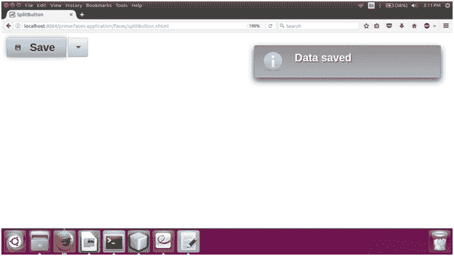

# PrimeFaces 拆分按钮

> 原文:[https://www.javatpoint.com/primefaces-splitbutton](https://www.javatpoint.com/primefaces-splitbutton)

这是一个按钮，显示一个默认命令和一个叠加的附加命令。它用于提供多个命令。在 JSF 应用程序中，使用 **< p:splitButton >** 组件来创建 splitButton。下表包含该组件的重要属性。

## 拆分按钮属性

| 属性 | 缺省值 | 类型 | 描述 |
| 编号 | 空 | 线 | 它是组件的唯一标识符。 |
| 价值 | 空 | 线 | 它用于设置按钮的标签。 |
| 行为 | 空 | xpr/String 方法 | 是方法表达式还是字符串结果？当按钮被点击时被处理。 |
| 动作监听器 | 空 | xpr 方法 | 它用于设置动作监听器。 |
| 类型 | 使服从 | 线 | 它设置按钮的行为。 |
| 创建交互式、快速动态网页应用的网页开发技术 | 真实的 | 布尔代数学体系的 | 它指定了提交模式，当设置为真(默认)时，将使用 Ajax 提交。 |
| 异步ˌ非同步(asynchronous) | 错误的 | 布尔代数学体系的 | 当设置为 true 时，ajax 请求不会排队。 |
| 过程 | 空 | 线 | 它将组件设置为部分处理，而不是整个视图。 |
| 更新 | 空 | 线 | 它将组件设置为用 ajax 更新。 |
| onstart | 空 | 线 | 它用于在 ajax 请求开始之前执行客户端脚本。 |
| 全球的 | 真实的 | 布尔 | 它定义了是否触发 ajaxStatus。 |
| 耽搁 | 空 | 线 | 它用于设置延迟时间。 |
| 超时 | Zero | 整数 | 它用于以毫秒为单位设置 ajax 请求的超时。 |
| 风格 | 空 | 线 | 用于设置按钮元素的内嵌 CSS。 |

## 例子

这里，在下面的例子中，我们正在实现 **< p:splitButton >** 组件。本示例包含以下文件。

### JSF 档案

**// splitButton.xhtml**

```java

<?xml version='1.0' encoding='UTF-8' ?>
<!DOCTYPE html PUBLIC "-//W3C//DTD XHTML 1.0 Transitional//EN""http://www.w3.org/TR/xhtml1/DTD/xhtml1-transitional.dtd">
<html 
xmlns:h="http://xmlns.jcp.org/jsf/html"
xmlns:p="http://primefaces.org/ui">
<h:head>
<title>SplitButton</title>
</h:head>
<h:body>
<h:form>
<p:growl id="messages" />
<p:splitButton value="Save" actionListener="#{splitButton.save}" update="messages" icon="ui-icon-disk">
<p:menuitem value="Update" actionListener="#{splitButton.update}" update="messages" icon="ui-icon-arrowrefresh-1-w" />
<p:menuitem value="Delete" actionListener="#{splitButton.delete}" ajax="false" icon="ui-icon-close" />
<p:separator />
<p:menuitem value="Homepage" url="http://www.javatpoint.com" icon="ui-icon-extlink" />
</p:splitButton>
</h:form>
</h:body>
</html>

```

### ManagedBean

**//SplitButton.java**

```java

package com.javatpoint;
import javax.faces.application.FacesMessage;
import javax.faces.bean.ManagedBean;
import javax.faces.context.FacesContext;
import javax.faces.event.ActionEvent;
@ManagedBean
public class SplitButton {
public void save(ActionEvent actionEvent) {
addMessage("Data saved");
}
public void update(ActionEvent actionEvent) {
addMessage("Data updated");
}
public void delete(ActionEvent actionEvent) {
addMessage("Data deleted");
}
public void addMessage(String summary) {
FacesMessage message = new FacesMessage(FacesMessage.SEVERITY_INFO, summary,  null);
FacesContext.getCurrentInstance().addMessage(null, message);
}
}

```

输出:



