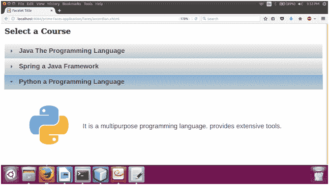

# PrimeFaces accordionPanel

> 原文：<https://www.javatpoint.com/primefaces-accordionpanel>

它是一个显示垂直堆叠面板的容器组件。它用于以手风琴格式显示数据。我们可以随时从一个项目切换到另一个项目，只需点击那个项目。当用户想要一次查看集合中的单个项目时，这很有用。

PrimeFaces 提供**T2【p】:手风琴面板>T1】组件在 JSF 创建手风琴应用。**

下面列出了它的各种属性。

## 符合面板属性

| 属性 | 缺省值 | 类型 | 描述 |
| 编号 | 空 | 线 | 它是组件的唯一标识符。 |
| activeIndex | 错误的 | 线 | 它用于设置活动选项卡的索引。 |
| 风格 | 空 | 线 | 它用于设置容器元素的内联 CSS。 |
| onTabChange | 空 | 线 | 它用于在单击非活动选项卡时调用脚本。 |
| 安大略省 | 空 | 线 | 它用于在选项卡被激活时调用客户端脚本。 |
| onTabClose | 空 | 线 | 它用于在选项卡关闭时调用客户端脚本来调用。 |
| 动态的 | 错误的 | 布尔代数学体系的 | 它定义了切换模式。 |
| 躲藏 | 真实的 | 布尔代数学体系的 | 它定义了激活动态选项卡是否应该再次从服务器加载内容。 |
| 价值 | 空 | 目录 | 列表需要迭代才能显示动态数量的选项卡。 |
| 定义变量 | 空 | 线 | 这是一个迭代器的名称，用于动态数量的标签 |
| tabController | 空 | MethodExpr | 它用于设置服务器端侦听器，以决定是否允许选项卡更改或选项卡关闭。 |

## 例子

在下面的例子中，我们实现了 **< p:accordionPanel >** 组件。本示例包含以下文件。

### JSF 档案

**// accordian.xhtml**

```java

<?xml version='1.0' encoding='UTF-8' ?>
<!DOCTYPE html PUBLIC "-//W3C//DTD XHTML 1.0 Transitional//EN""http://www.w3.org/TR/xhtml1/DTD/xhtml1-transitional.dtd">
<html 
xmlns:h="http://xmlns.jcp.org/jsf/html"
xmlns:p="http://primefaces.org/ui">
<h:head>
<title>Accordion Panel</title>
</h:head>
<h:body>
<h:form id="form">
<p:growl id="msgs" showDetail="true" />
<h3 style="margin-top:0">Select a Course</h3>
<p:accordionPanel>
<p:tab title="Java The Programming Language">
<h:panelGrid columns="2" cellpadding="10">
<p:graphicImage name="images/courses/java.png" />
<h:outputText
value="This program includes Java core concepts and collection framework." />
</h:panelGrid>
</p:tab>
<p:tab title="Spring a Java Framework">
<h:panelGrid columns="2" cellpadding="10">
<p:graphicImage name="images/courses/spring.png" />
<h:outputText value="It is a Java Framework. It is designed to make web applications." />
</h:panelGrid>
</p:tab>
<p:tab title="Python a Programming Language">
<h:panelGrid columns="2" cellpadding="10">
<p:graphicImage name="images/courses/python.png" />
<h:outputText value="It is a multipurpose programming language. provides extensive tools." />
</h:panelGrid>
</p:tab>
</p:accordionPanel>
</h:form>
</h:body>
</html>

```

输出:


