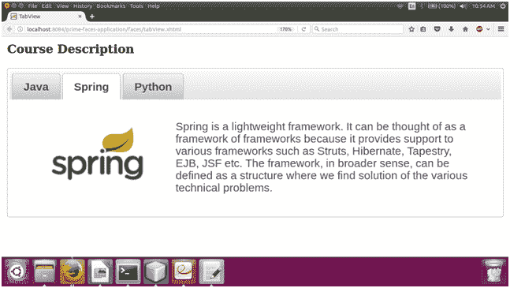

# TabView 基本知识

> 原文:[https://www.javatpoint.com/primefaces-tabview](https://www.javatpoint.com/primefaces-tabview)

它是一个容器组件，用于将同一网页的标签中的内容分组。使用 **< p:tabView >** 组件创建容器。 **< p:tab >** 是 **< p:tabView >** 的子组件，用于单独创建 tab。当我们想在同一个网页上显示更多信息时，这很有用。

## 选项卡视图属性

| 属性 | 缺省值 | 类型 | 描述 |
| 提供 | 真实的 | 布尔代数学体系的 | 它使用布尔值来指定组件的呈现。 |
| activeIndex | Zero | 整数 | 用于设置活动标签的索引。 |
| 影响 | 空 | 线 | 它用于设置过渡效果的名称。 |
| 效果持续时间 | 空 | 线 | 它用于设置过渡效果的持续时间。 |
| 动态的 | 错误的 | 布尔代数学体系的 | 它支持惰性标签的惰性加载。 |
| 躲藏 | 真实的 | 布尔代数学体系的 | 它用于设置缓存。 |
| onTabChange | 空 | 线 | 它在单击选项卡时执行。 |
| 安大略省 | 空 | 线 | 当显示一个选项卡时，它执行。 |
| onTabClose | 空 | 线 | 它在标签关闭时执行。 |
| 风格 | 空 | 线 | 它用于设置主容器的内联样式。 |
| 定义变量 | 空 | 线 | 它是迭代器的一个名称，用来引用集合中的一个项目。 |
| 价值 | 空 | 目标 | 它是一个显示动态选项卡的集合模型。 |
| 方向 | 顶端 | 线 | 它用于设置选项卡标题的方向。 |
| 目录 | 符号 | 线 | 它定义文本方向，有效值是 ltr 和 rtl。 |
| 可滚动 | 错误的 | 布尔代数学体系的 | 启用后，选项卡标题可以水平滚动而不是换行。 |
| 前置标识符 | 真实的 | 布尔代数学体系的 | 它用于前置 id。 |
| tab 键索引 | Zero | 线 | 它指定元素在跳转顺序中的位置。 |

## 例子

这里，在下面的例子中，我们正在实现 **< p:tabView >** 组件。本示例包含以下文件。

### JSF 档案

**// tabView.xhtml**

```java
<?xml version='1.0' encoding='UTF-8' ?>
<!DOCTYPE html PUBLIC "-//W3C//DTD XHTML 1.0 Transitional//EN""http://www.w3.org/TR/xhtml1/DTD/xhtml1-transitional.dtd">
<html 
xmlns:h="http://xmlns.jcp.org/jsf/html"
xmlns:p="http://primefaces.org/ui">
<h:head>
<title>TabView</title>
</h:head>
<h:body>
<h:form id="form">
<p:growl id="msgs" showDetail="true" />
<h3 style="margin-top:0">Course Description</h3>
<p:tabView>
<p:tab title="Java">
<h:panelGrid columns="2" cellpadding="10">
<p:graphicImage name="images/courses/java.png" />
<h:outputText
value="Java is a programming language and a platform.
Java is a high level, robust, secured and object-oriented programming language.
Platform: Any hardware or software environment in which a program runs, is known as a platform. 
Since Java has its own runtime environment (JRE) and API, it is called platform." />
</h:panelGrid>
</p:tab>
<p:tab title="Spring">
<h:panelGrid columns="2" cellpadding="10">
<p:graphicImage name="images/courses/spring.png" />
<h:outputText value="Spring is a lightweight framework. It can be thought of as a framework 
of frameworks because it provides support to various frameworks such as Struts, Hibernate, Tapestry, EJB, JSF etc. 
The framework, in broader sense, can be defined as a structure where we find solution of the various technical problems. " />
</h:panelGrid>
</p:tab>
<p:tab title="Python">
<h:panelGrid columns="2" cellpadding="10">
<p:graphicImage name="images/courses/python.png" />
<h:outputText value="Python is a simple, easy to learn, powerful, high level and object-oriented 
programming language. Guido Van Rossum is known as the founder of python programming." />
</h:panelGrid>
</p:tab>
</p:tabView>
</h:form>
</h:body>
</html>

```

输出:


