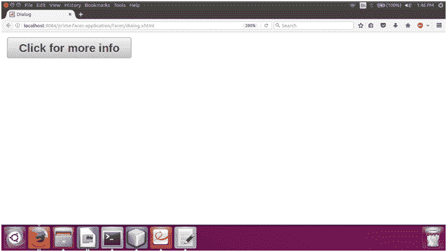
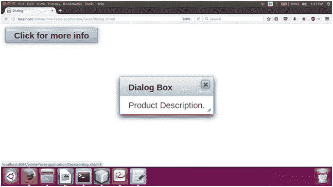

# 素数面对话框

> 原文:[https://www.javatpoint.com/primefaces-dialog](https://www.javatpoint.com/primefaces-dialog)

它是一个面板组件，可以覆盖页面上的其他元素。它用于创建一个弹出窗口，也可以用来显示其他元素。它提供了两种方法 show()和 hide()来管理组件的可见性。

在 JSF 应用程序中，使用 **< p:对话框>** 创建对话框。下面列出了它的各种属性。

## 对话框属性

| 属性 | 缺省值 | 类型 | 描述 |
| 页眉 | 空 | 线 | 它用于设置标题的文本。 |
| 可拖动的 | 真实的 | 布尔代数学体系的 | 它指定了可拖动性。 |
| 可调整大小的 | 真实的 | 布尔代数学体系的 | 它指定了弹性。 |
| 情态的 | 错误的 | 布尔代数学体系的 | 它启用了模态。 |
| 看得见的 | 错误的 | 布尔代数学体系的 | 启用时，对话框默认可见。 |
| 宽度 | 汽车 | 整数 | 它用于设置对话框的宽度。 |
| 高度 | 汽车 | 整数 | 它用于设置对话框的高度。 |
| 最小宽度 | One hundred and fifty | 整数 | 它用于设置可调整大小的对话框的最小宽度。 |
| 最小高度 | Zero | 整数 | 它用于设置可调整大小的对话框的最小高度。 |
| 风格 | 空 | 线 | 它用于设置对话框的内联样式。 |
| 显示标题 | 真实的 | 布尔代数学体系的 | 它定义了标题内容的可见性。 |
| 位置类型 | 固定的；不变的 | 线 | 它定义了对话框是在滚动时保持在视口中还是保持其位置。 |
| 应答的 | 错误的 | 布尔代数学体系的 | 它用于使组件响应。 |
| 页脚 | 空 | 线 | 用于设置页脚文本。 |

## 例子

这里，在下面的例子中，我们正在实现 **< p:dialog >** 组件。本示例包含以下文件。

### JSF 档案

**// dialog.xhtml**

```java

<?xml version='1.0' encoding='UTF-8' ?>
<!DOCTYPE html PUBLIC "-//W3C//DTD XHTML 1.0 Transitional//EN""http://www.w3.org/TR/xhtml1/DTD/xhtml1-transitional.dtd">
<html 
xmlns:h="http://xmlns.jcp.org/jsf/html"
xmlns:p="http://primefaces.org/ui">
<h:head>
<title>Dialog</title>
</h:head>
<h:body>
<p:commandButton value="Click for more info" type="button" onclick="PF('sample').show();" />
<p:dialog header="Dialog Box" widgetVar="sample" minHeight="40">
<h:outputText value="Product Description." />
</p:dialog>
</h:body>
</html>

```

输出:


