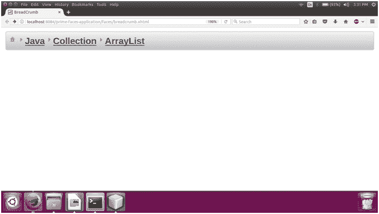

# PrimeFaces 面包屑

> 原文:[https://www.javatpoint.com/primefaces-breadcrumb](https://www.javatpoint.com/primefaces-breadcrumb)

它是一个导航组件，用于提供关于页面层次结构的上下文信息。它显示导航信息，并允许通过点击导航链接重定向到任何页面。在 JSF 应用程序中，使用 **< p:面包屑>** 组件创建导航。重要属性如下表所示。

## 面包屑属性

| 属性 | 缺省值 | 类型 | 描述 |
| 模型 | 空 | 功能表模型 | 它用于以编程方式创建菜单。 |
| 风格 | 空 | 线 | 用于设置主容器元素的样式。 |
| styleClass(样式类) | 空 | 线 | 用于设置主容器的样式类。 |
| 家庭显示器 | 图标 | 线 | 用于定义根链接的显示模式。 |

## 例子

在下面的例子中，我们实现了 **< p:面包屑>** 组件。本示例包含以下文件。

### JSF 档案

**//面包屑. xhtml**

```java

<?xml version='1.0' encoding='UTF-8' ?>
<!DOCTYPE html PUBLIC "-//W3C//DTD XHTML 1.0 Transitional//EN""http://www.w3.org/TR/xhtml1/DTD/xhtml1-transitional.dtd">
<html 
xmlns:h="http://xmlns.jcp.org/jsf/html"
xmlns:p="http://primefaces.org/ui">
<h:head>
<title>BreadCrumb</title>
</h:head>
<h:body>
<p:breadCrumb>
<p:menuitem value="Home" url="https://www.javatpoint.com/" />
<p:menuitem value="Java" url="https://www.javatpoint.com/java-tutorial" />
<p:menuitem value="Collection" url="https://www.javatpoint.com/collections-in-java" />
<p:menuitem value="ArrayList" url="https://www.javatpoint.com/java-arraylist" />
</p:breadCrumb>
</h:body>
</html>

```

输出:

