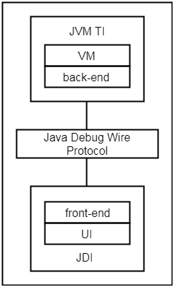

# JDB 建筑

> 原文:[https://www.javatpoint.com/jdb-architecture](https://www.javatpoint.com/jdb-architecture)

Java 调试器体系结构由三个接口组成:-

*   JVM 工具接口
*   Java 调试器有线协议
*   Java 调试器接口(JDI)

**JDB 架构**

## JVM 工具接口

Java 虚拟机工具接口(JVM TI)提供了虚拟机(VM)调试所需的服务。它检查状态并控制在 JVM 中运行的应用程序的执行。它支持所有需要访问 JVM 状态的工具，如调试、分析、线程分析、监控和覆盖分析工具。

## Java 调试器有线协议

JDWP 的作用是定义调试器前端和正在调试的进程之间的请求和信息的格式。因此，它支持调试器和 JVM 之间的通信。

它允许调试器在同一台计算机或远程计算机上的不同进程中工作。虽然 JDWP 是可选的。

## Java 调试器接口

JDI 是 Java 调试器的最上层，它在用户代码级别定义信息和请求。它具有控制虚拟机执行的能力。除此之外，它还可以挂起和恢复线程。