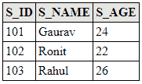

# 插入实体

> 原文:[https://www.javatpoint.com/jpa-inserting-an-entity](https://www.javatpoint.com/jpa-inserting-an-entity)

在 JPA 中，我们可以通过实体轻松地将数据插入数据库。EntityManager 提供了 persist()方法来插入记录。

## JPA 实体插入示例

在这里，我们将插入学生的记录。

该示例包含以下步骤:-

*   在包含属性 s_id、s_name、s_age 的 com.javatpoint.jpa.student 包下创建一个名为 StudentEntity.java 的实体类。

**学生学位。java**

```java

package com.javatpoint.jpa.student;
import javax.persistence.*;

@Entity
@Table(name="student")
public class StudentEntity {

	@Id
	private int s_id;
	private String s_name;
	private int s_age;

	public StudentEntity(int s_id, String s_name, int s_age) {
		super();
		this.s_id = s_id;
		this.s_name = s_name;
		this.s_age = s_age;
	}

	public StudentEntity() {
		super();
	}

	public int getS_id() {
		return s_id;
	}

	public void setS_id(int s_id) {
		this.s_id = s_id;
	}

	public String getS_name() {
		return s_name;
	}

	public void setS_name(String s_name) {
		this.s_name = s_name;
	}

	public int getS_age() {
		return s_age;
	}

	public void setS_age(int s_age) {
		this.s_age = s_age;
	}

}

```

*   现在，在 Persistence.xml 文件中映射实体类和其他数据库配置。

**Persistence.xml**

```java

<persistence>
<persistence-unit name="Student_details">

	<class>com.javatpoint.jpa.student.StudentEntity</class>

<properties>
<property name="javax.persistence.jdbc.driver" value="com.mysql.jdbc.Driver"/>
<property name="javax.persistence.jdbc.url" value="jdbc:mysql://localhost:3306/studentdata"/>
<property name="javax.persistence.jdbc.user" value="root"/>
<property name="javax.persistence.jdbc.password" value=""/>
<property name="eclipselink.logging.level" value="SEVERE"/>
<property name="eclipselink.ddl-generation" value="create-or-extend-tables"/>
</properties>

	</persistence-unit>
</persistence>

```

*   在 com.javatpoint.jpa.persist 包下创建一个名为 PersistStudent.java 的持久性类，用数据持久化实体对象。

**PersistStudent.java**

```java

package com.javatpoint.jpa.persist;

import com.javatpoint.jpa.student.*;
import javax.persistence.*;
public class PersistStudent {

	public static void main(String args[])
	{

		EntityManagerFactory emf=Persistence.createEntityManagerFactory("Student_details");
		EntityManager em=emf.createEntityManager();

em.getTransaction().begin();

		StudentEntity s1=new StudentEntity();
		s1.setS_id(101);
		s1.setS_name("Gaurav");
		s1.setS_age(24);

		StudentEntity s2=new StudentEntity();
		s2.setS_id(102);
		s2.setS_name("Ronit");
		s2.setS_age(22);

		StudentEntity s3=new StudentEntity();
		s3.setS_id(103);
		s3.setS_name("Rahul");
		s3.setS_age(26);

		em.persist(s1);
		em.persist(s2);
		em.persist(s3);		

em.getTransaction().commit();

		emf.close();
		em.close();

	}
}

```

**输出:**

程序执行后，学生表在 MySQL 工作台下生成。此表包含学生详细信息。要获取数据，在 MySQL 中运行**从学生**中选择*查询。

