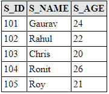
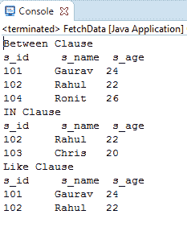
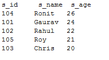

# JPA JPQL 高级操作

> 原文：<https://www.javatpoint.com/jpa-jpql-advanced-operations>

使用 JPQL，我们可以执行任何类型的数据库操作。在这里，我们将使用简单的示例来执行 JPQL 的一些高级操作。

让我们考虑具有以下记录的学生表。



## JPQL 高级查询示例

在这个例子中，我们将获取一个基本的实体类(在这个例子中是 StudentEntity.java)，并对其执行不同的操作。

*   在 com.javatpoint.jpa 包下创建一个名为 StudentEntity.java 的实体类。

**学生学位。java**

```java

package com.javatpoint.jpa;
import javax.persistence.*;

@Entity
@Table(name="student")
public class StudentEntity {

	@Id
	private int s_id;
	private String s_name;
	private int s_age;

	public StudentEntity(int s_id, String s_name, int s_age) {
		super();
		this.s_id = s_id;
		this.s_name = s_name;
		this.s_age = s_age;
	}

	public StudentEntity() {
		super();
	}

	public int getS_id() {
		return s_id;
	}

	public void setS_id(int s_id) {
		this.s_id = s_id;
	}

	public String getS_name() {
		return s_name;
	}

	public void setS_name(String s_name) {
		this.s_name = s_name;
	}

	public int getS_age() {
		return s_age;
	}

	public void setS_age(int s_age) {
		this.s_age = s_age;
	}

}

```

*   现在，在 Persistence.xml 文件中映射实体类和其他数据库配置。

**Persistence.xml**

```java

<persistence>
<persistence-unit name="Student_details">

      <class>com.javatpoint.jpa.StudentEntity</class>

      <properties>
         <property name="javax.persistence.jdbc.driver" value="com.mysql.jdbc.Driver"/>
         <property name="javax.persistence.jdbc.url" value="jdbc:mysql://localhost:3306/studentdata"/>
         <property name="javax.persistence.jdbc.user" value="root"/>
         <property name="javax.persistence.jdbc.password" value=""/>
         <property name="eclipselink.logging.level" value="SEVERE"/>
         <property name="eclipselink.ddl-generation" value="create-or-extend-tables"/>
      </properties>

   </persistence-unit>
</persistence>

```

*   现在，我们可以在 StudentEntity.java 类上执行以下任何操作。

## JPQL 过滤器

在这里，我们将对一个表执行一些过滤操作。

**Filter.java**

```java

package com.javatpoint.jpa.jpql;
import com.javatpoint.jpa.StudentEntity;
import javax.persistence.*;
import java.util.*;
public class Filter {

	 public static void main( String args[]) {

	      EntityManagerFactory emf = Persistence.createEntityManagerFactory( "Student_details" );
	      EntityManager em = emf.createEntityManager();
	      em.getTransaction().begin( );

	    Query q1 = em.createQuery("Select s from StudentEntity s where s.s_age between 22 and 28");

	    @SuppressWarnings("unchecked")
		List l1 =  (List<studententity>)q1.getResultList();

	     System.out.println("Between Clause");
	     System.out.print("s_id");
	     System.out.print("\t s_name");
	     System.out.println("\t s_age");

	      for(StudentEntity s:l1)
	      {
	      System.out.print(s.getS_id());
	      System.out.print("\t"+s.getS_name());
	      System.out.println("\t"+s.getS_age());
	      }

	      Query q2 = em.createQuery("Select s from StudentEntity s where s.s_age IN(20,22,23)");

		    @SuppressWarnings("unchecked")
			List <studententity>l2 =  (List<studententity>)q2.getResultList();

		     System.out.println("IN Clause");
		     System.out.print("s_id");
		     System.out.print("\t s_name");
		     System.out.println("\t s_age");

		      for(StudentEntity s:l2)
		      {
		      System.out.print(s.getS_id());
		      System.out.print("\t"+s.getS_name());
		      System.out.println("\t"+s.getS_age());
		      }

		      Query q3 = em.createQuery("Select s from StudentEntity s where s.s_name like '%a%'");

			    @SuppressWarnings("unchecked")
				List <studententity>l3 =  (List<studententity>)q3.getResultList();

			     System.out.println("Like Clause");
			     System.out.print("s_id");
			     System.out.print("\t s_name");
			     System.out.println("\t s_age");

			      for(StudentEntity s:l3)
			      {
			      System.out.print(s.getS_id());
			      System.out.print("\t"+s.getS_name());
			      System.out.println("\t"+s.getS_age());
			      }

	      em.getTransaction().commit();
	      em.close();
	      emf.close();  
	 }
}</studententity></studententity></studententity></studententity></studententity> 
```

**输出:**



## JPQL 聚合

在这里，我们将对一个表执行一些聚合操作。

**Aggregate.java**

```java

package com.javatpoint.jpa.jpql;
import com.javatpoint.jpa.StudentEntity;
import javax.persistence.*;
import java.util.*;
public class Aggregate {

	 public static void main( String args[]) {

	      EntityManagerFactory emf = Persistence.createEntityManagerFactory( "Student_details" );
	      EntityManager em = emf.createEntityManager();
	      em.getTransaction().begin( );

	      Query q1 = em.createQuery("Select count(s) from StudentEntity s");
	      System.out.println("Number of Student : "+q1.getSingleResult());

	      Query q2 = em.createQuery("Select MAX(s.s_age) from StudentEntity s");
	      System.out.println("Maximum age : "+q2.getSingleResult());

	      Query q3 = em.createQuery("Select MIN(s.s_age) from StudentEntity s");
	      System.out.println("Minimum age : "+q3.getSingleResult());
em.getTransaction().commit();
	      em.close();
	      emf.close();  
	 }
}

```

**输出:**


## JPQL 排序

这里，我们将根据 s_age 属性对表的元素进行排序。

**Sorting.java**

```java

package com.javatpoint.jpa.jpql;
import com.javatpoint.jpa.StudentEntity;
import javax.persistence.*;
import java.util.*;
public class Sorting {

	 public static void main( String args[]) {

	      EntityManagerFactory emf = Persistence.createEntityManagerFactory( "Student_details" );
	      EntityManager em = emf.createEntityManager();
	      em.getTransaction().begin( );

	      Query q1 = em.createQuery("Select s from StudentEntity s order by s.s_age desc");

		    @SuppressWarnings("unchecked")
			List l1 =  (List<studententity>)q1.getResultList();

		     System.out.print("s_id");
		     System.out.print("\t s_name");
		     System.out.println("\t s_age");

		      for(StudentEntity s:l1)
		      {
		      System.out.print(s.getS_id());
		      System.out.print("\t"+s.getS_name());
		      System.out.println("\t"+s.getS_age());
		      }

em.getTransaction().commit();
	      em.close();
	      emf.close();  
	 }
}</studententity> 
```

**输出:**

