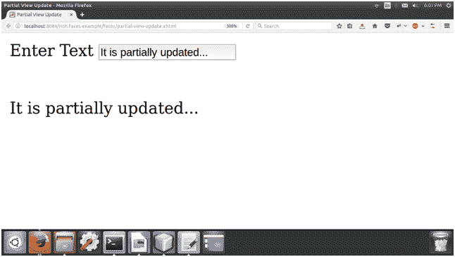

# 部分视图更新

> 原文:[https://www.javatpoint.com/richfaces-partial-view-updates](https://www.javatpoint.com/richfaces-partial-view-updates)

我们可以使用 render 属性来指定为 Ajax 更新呈现哪些组件。render 属性可以指向要更新的特定组件的 id 标识符。组件也可以通过使用表达式语言来识别。

渲染属性接受以下关键字:

| 关键字 | 功能 |
| @all | 它用于更新每个组件。 |
| @无 | 它用于不更新任何组件。 |
| @这个 | 它用于请求更新具有 execute 属性的组件。 |
| @form | 它用于更新包含所请求组件的表单。 |
| @区域 | 包含请求组件的区域将被更新。使用<region>组件作为包装元素来指定区域。</region> |

* * *

我们应该通过设置 ajaxRendered = " true "来使用<outputpanel>组件。</outputpanel>

<message>和<messages>组件基于<outputpanel>组件，因此也将一直更新。若要重写此行为，请在请求组件上使用 limitRender="true "设置。</outputpanel></messages></message>

**// index.xhtml**

```java

<?xml version='1.0' encoding='UTF-8' ?>
<!DOCTYPE html PUBLIC "-//W3C//DTD XHTML 1.0 Transitional//EN""http://www.w3.org/TR/xhtml1/DTD/xhtml1-transitional.dtd">
<html 
xmlns:h="http://xmlns.jcp.org/jsf/html"
xmlns:a4j="http://richfaces.org/a4j">
<h:head>
<title>Partial View Update</title>
</h:head>
<h:body>
<h:form>
<h:outputText value="Enter Text "></h:outputText>
<h:inputText id="name1" value="#{user.name}">
<a4j:ajax event="keyup" render="name2"></a4j:ajax>
</h:inputText>
</h:form>
<br/>
<br/>
<a4j:outputPanel ajaxRendered="true">
<h:outputText value="#{user.name}"></h:outputText>
</a4j:outputPanel>
</h:body>
</html>

```

**//User.java**

```java

import javax.faces.bean.ManagedBean;
import javax.faces.bean.RequestScoped;
@ManagedBean
@RequestScoped
public class User {
String name;
public String getName() {
return name;
}
public void setName(String name) {
this.name = name;
}
}

```

输出:



* * *