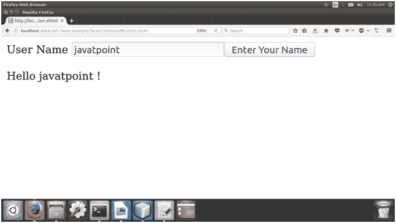

# richfaces〔t0〕

> 原文:[https://www.javatpoint.com/richfaces-a4j-commandbutton](https://www.javatpoint.com/richfaces-a4j-commandbutton)

< **a4j:commandButton** >组件类似于 JavaServer Faces(JSF)<**h:command button**>组件，但还包括 Ajax 支持。

它只需要使用一个值属性。我们可以用它来设置命令按钮的文本。

默认情况下，< **a4j:命令按钮** >使用点击事件代替提交事件。

#### 注意-<**a4j:命令按钮** >组件默认具有 execute =“@ form”设置。要将渲染限制在不同的范围内，请重新定义 execute 属性。

* * *

## 例子

在下面的例子中，我们实现了< **a4j:commandButton** >组件。本示例包含以下文件。

### JSF 档案

**// commandButton.xhtml**

```java

<!DOCTYPE html>
<ui:composition 
xmlns:h="http://java.sun.com/jsf/html"
xmlns:f="http://java.sun.com/jsf/core"
xmlns:ui="http://java.sun.com/jsf/facelets"
xmlns:a4j="http://richfaces.org/a4j"
xmlns:rich="http://richfaces.org/rich">
<h:form id="form">
<h:outputText value="User Name " />
<h:inputText value="#{user.name}" />
<a4j:commandButton value="Enter Your Name" execute="@form" />
</h:form>
<br/>
<a4j:outputPanel>
<h:outputText value="Hello #{user.name} !" rendered="#{not empty user.name}" />
</a4j:outputPanel>
</ui:composition>

```

### 托管 Bean

**//User.java**

```java

import javax.faces.bean.ManagedBean;
import javax.faces.bean.RequestScoped;
@ManagedBean
@RequestScoped
public class User {
String name;
public String getName() {
return name;
}
public void setName(String name) {
this.name = name;
}
}

```

输出:



* * *