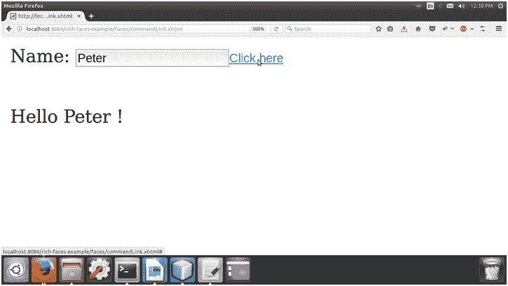

# richfaces〔t0〕

> 原文：<https://www.javatpoint.com/richfaces-a4j-commandlink>

它类似于 JavaServer Faces(JSF)<**h:commandLink**>组件，除了它包括插入式 Ajax 行为。

< **a4j:commandLink** >只需要使用值属性。我们应该使用这个属性来设置链接的文本。

#### 注意-<**a4j:command link**>使用点击事件代替提交事件。

* * *

## 例子

在下面的例子中，我们实现了< **a4j:commandLink** >组件。本示例包含以下文件。

### JSF 档案

**// commandLink.xhtml**

```java

<ui:composition 
xmlns:h="http://java.sun.com/jsf/html"
xmlns:f="http://java.sun.com/jsf/core"
xmlns:ui="http://java.sun.com/jsf/facelets"
xmlns:a4j="http://richfaces.org/a4j"
xmlns:rich="http://richfaces.org/rich">
<h:head></h:head>
<h:form id="form">
<h:outputText value="Name: " />
<h:inputText value="#{user.name}" />
<a4j:commandLink value="Click here" render="out" execute="@form" />
</h:form>
<br />
<a4j:outputPanel id="out">
<h:outputText value="Hello #{user.name} !" rendered="#{not empty user.name}" />
</a4j:outputPanel>
</ui:composition>

```

### 托管 Bean

**//User.java**

```java

import javax.faces.bean.ManagedBean;
import javax.faces.bean.RequestScoped;
@ManagedBean
@RequestScoped
public class User {
String name;
public String getName() {
return name;
}
public void setName(String name) {
this.name = name;
}
}

```

输出:



* * *