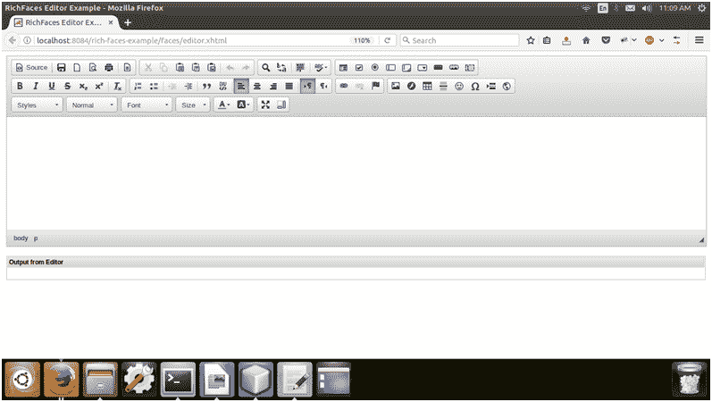
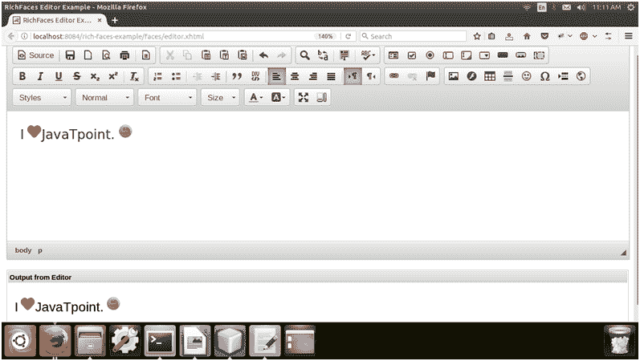

# RichFaces 编辑器

> 原文:[https://www.javatpoint.com/richfaces-rich-editor](https://www.javatpoint.com/richfaces-rich-editor)

RichFaces 提供了< **rich:editor** >组件，用于在 HTML 页面中创建一个所见即所得的编辑器。

< **rich:editor** >组件基于 CKEditor 实现。当渲染一个< rich:editor >时，一旦页面被完全加载，一个文本区域就被渲染到页面上。

#### 注意:<editor>要求组件出现在视图中，并且必须是编辑器的祖先，这样资源依赖关系才能正确呈现。</editor>

## 样式类和外观参数

下表包含编辑器的样式类和相应的外观参数。

| 班级 | 皮肤参数 | 映射的 CSS 属性 |
| . corner _ skin _ rich faces | panelBorderColor | 边框颜色 |
| 。cke_skin_richfaces。cke _ wrapper | 编辑主背景颜色 | 背景色 |
| 。cke_skin_richfaces。cke_dialog_body | panel border color general background color | 边框颜色背景 |
| 。cke_skin_richfaces。cke_dialog_title | 标题背景颜色标题字体 | 重复-x 字体粗细 |
| 。cke_skin_richfaces。cke_path a，。cke_skin_richfaces。cke_path。cke _ 空 | 编辑主文本颜色 | 颜色 |
| 。cke_skin_richfaces。cke _ 按钮 a.cke_on | 附加背景颜色面板边框颜色 | 背景色边框颜色 |
| 。cke_skin_richfaces。悬停，。cke_skin_richfaces。焦点。cke_skin_richfaces。cke _ 按钮 a:激活 | tabBackgroundColor | 背景色 |

* * *

## 例子

这里，在下面的例子中，我们正在实现< **rich:editor** >组件。本示例包含以下文件。

### JSF 档案

**// editor.xhtml**

```java

<ui:composition 
xmlns:h="http://java.sun.com/jsf/html"
xmlns:f="http://java.sun.com/jsf/core"
xmlns:ui="http://java.sun.com/jsf/facelets"
xmlns:a4j="http://richfaces.org/a4j"
xmlns:rich="http://richfaces.org/rich">
<f:view>
<h:head>
<title>RichFaces Editor Example</title>
</h:head>
<h:body>
<h:form id="form">
<rich:editor id="editor" toolbar="full" value="#{editor.textArea}" style="margin-bottom: 1em">
<a4j:ajax event="change" render="panel" status="panelUpdateStatus" />
<a4j:ajax event="dirty" render="panel" status="panelUpdateStatus">
<a4j:attachQueue requestDelay="4000" />
</a4j:ajax>
</rich:editor>
<rich:panel id="panel">
<f:facet name="header">
Output from Editor
<a4j:status name="panelUpdateStatus">
<f:facet name="start">
(Updating)
</f:facet>
</a4j:status>
</f:facet>
<h:outputText escape="false" value="#{editor.textArea}" />
</rich:panel>
</h:form>
</h:body>
</f:view>
</ui:composition>

```

### 托管 Bean

**//Editor.java**

```java

import javax.faces.bean.ManagedBean;
import javax.faces.bean.RequestScoped;
@ManagedBean
@RequestScoped
public class Editor {
String textArea;
public String getTextArea() {
return textArea;
}
public void setTextArea(String textArea) {
this.textArea = textArea;
}
}

```

输出:

 

* * *