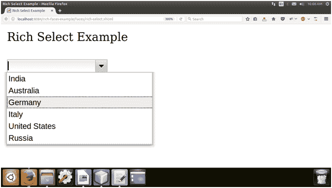

# richfaces〔t0〕

> 原文：<https://www.javatpoint.com/richfaces-rich-select>

该组件提供了一个下拉列表框，用于从多个选项中选择单个值。它类似于 JSF UISelectOne 组件。

我们可以在自动完成模式下使用它，其中下拉列表中的值是使用自动完成方法或自动完成列表属性动态提供的。

## 样式类和外观参数

下表包含 select 的样式类和相应的外观参数。

| 班级 | 功能 | 皮肤参数 | 映射的 CSS 属性 |
| 。RF sel(射频 sel) | 它用于定义选择控件本身的样式。 | 没有皮肤参数。 |  |
| . RF-sel-CNT | 它用于为选择控件的容器定义样式。 | panelBorderColor | 边框颜色 |
| 。RF-sel InP | 它用于定义选择控件输入字段的样式。 | controlBackgroundColor | 背景色 |
| .rf-sel-fld-err | 它用于在出现错误时定义输入字段的样式。 | 没有皮肤参数。 |  |
| 。RF sel 选项 | 它用于为选择控件中的选项定义样式。 | 常规文本颜色常规大小字体 | 彩色字体大小 |
| 。RF-sel-盐 | 它用于为选择控件的选定选项定义样式。 | 常规文本颜色 | 边框颜色 |
| 。射频-sel-dflt-lbl | 它用于为选择控件的默认标签定义样式。 | 没有皮肤参数。 |  |
| 。rf-sel-btn | 它用于为选择控件的按钮定义样式。 | headerBackgroundColor | 背景色 |
| 。RF-sel BTN 箭 | 它用于定义按钮上箭头的样式。 | 没有皮肤参数。 |  |
| 。rf-sel-btn-dis | 它用于定义禁用时选择控件按钮的样式。 | 没有皮肤参数。 |  |
| 。射频-sel-lst-scrl | 它用于定义列表滚动条的样式。 | 没有皮肤参数。 |  |
| 。rf-sel-shdw | 它用于定义选择控件阴影的样式。 | 没有皮肤参数。 |  |
| 。射频-sel-shdw-t 射频-sel-shdw-b 射频-sel-shdw-lrf-sel-shdw-r 反应堆 | 这些类定义了选择控件阴影的顶部、底部、左侧和右侧边缘。 | 没有皮肤参数。 |  |

* * *

## 例子

这里，在下面的例子中，我们正在实现< **rich:选择** >组件。本示例包含以下文件。

### JSF 档案

**// rich-select.xhtml**

```java

<?xml version='1.0' encoding='UTF-8' ?>
<!DOCTYPE html PUBLIC "-//W3C//DTD XHTML 1.0 Transitional//EN""http://www.w3.org/TR/xhtml1/DTD/xhtml1-transitional.dtd">
<ui:composition 
xmlns:h="http://java.sun.com/jsf/html"
xmlns:f="http://java.sun.com/jsf/core"
xmlns:ui="http://java.sun.com/jsf/facelets"
xmlns:a4j="http://richfaces.org/a4j"
xmlns:rich="http://richfaces.org/rich">
<f:view>
<h:head>
<title>Rich Select Example</title>
</h:head>
<h:body>
<h:form>
<h:outputText value="Rich Select Example"/><br/><br/>
<rich:select>
<f:selectItems value="#{country.countryList()}" />
</rich:select>
</h:form>
</h:body>
</f:view>
</ui:composition>

```

### 托管 Bean

**//Country.java**

```java

import java.util.ArrayList;
import java.util.List;
import javax.faces.bean.ManagedBean;
import javax.faces.bean.RequestScoped;
@ManagedBean
@RequestScoped
public class Country {
String CountryName;
public List<String> countryList() {
ArrayList<String> list = new ArrayList<>();
list.add("India");
list.add("Australia");
list.add("Germany");
list.add("Italy");
list.add("United States");
list.add("Russia");
return list;
}
public String getCountryName() {
return CountryName;
}
public void setCountryName(String CountryName) {
this.CountryName = CountryName;
}
}

```

输出:



* * *