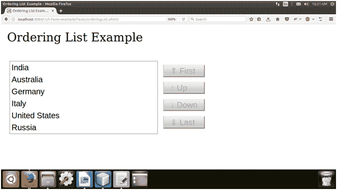
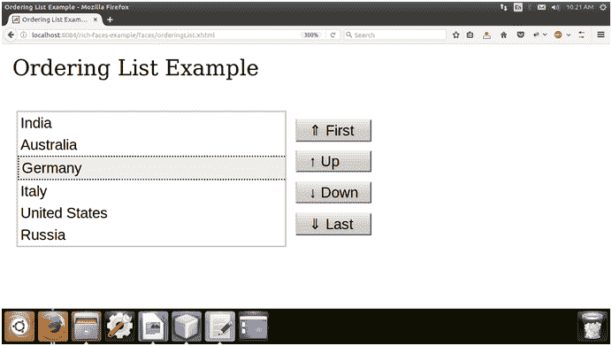

# richfaces〔t0〕

> 原文:[https://www.javatpoint.com/richfaces-rich-orderinglist](https://www.javatpoint.com/richfaces-rich-orderinglist)

RichFaces 提供了这个组件，用于在客户端对列表中的项目进行排序。我们需要对要排序的列表使用 value 属性。

它还提供了向上和向下按钮，你可以改变列表中元素的顺序。

## 样式类和外观参数

下表包含 orderingList 的样式类和外观参数。

| 类别(选择器) | 功能 | 皮肤参数 | 映射的 CSS 属性 |
| .rf 字 | 它用于为 orderingList 控件本身定义样式。 | 没有皮肤参数。 |  |
| . RF-ord-CNT | 它用于为 orderingList 控件的容器定义样式。 | 没有皮肤参数。 |  |
| . rf-ord-cptn | 它用于为 orderingList 控件的标题定义样式。 | 标题文本颜色标题字体 | 彩色字体大小 |
| 。射频 ord lst | 它用于为 orderingList 控件的项目列表定义样式。 | 没有皮肤参数。 |  |
| .rf-word-hdr | 它用于定义项目列表标题的样式。 | headerBackgroundColor header textcolor | 背景色 |
| 。RF-订单-选择 | 它用于为 orderingList 控件中的选项定义样式。 | 一般大小字体 | 字体大小 |
| .rf-word-sel | 它用于为 orderingList 控件的选定选项定义样式。 | 常规文本颜色 | 边框颜色 |
| 。射频-ord-dflt-lbl | 它用于为 orderingList 控件的默认标签定义样式。 | 没有皮肤参数。 |  |
| .rf-ord-btn | 它用于为 orderingList 控件的按钮定义样式。 | headerBackgroundColor | 背景色 |
| .rf-ord-btn-dis | 当 orderingList 控件被禁用时，它用于为该控件的按钮定义样式。 | 没有皮肤参数。 |  |
| . rf-ord-lst-scrl | 它用于定义列表滚动条的样式。 | 没有皮肤参数。 |  |

* * *

## 例子

在下面的例子中，我们实现了<**rich:ordinglist**>组件。本示例包含以下文件。

### JSF 档案

**// orderingList.xhtml**

```java

<?xml version='1.0' encoding='UTF-8' ?>
<!DOCTYPE html PUBLIC "-//W3C//DTD XHTML 1.0 Transitional//EN""http://www.w3.org/TR/xhtml1/DTD/xhtml1-transitional.dtd">
<ui:composition 
xmlns:h="http://java.sun.com/jsf/html"
xmlns:f="http://java.sun.com/jsf/core"
xmlns:ui="http://java.sun.com/jsf/facelets"
xmlns:a4j="http://richfaces.org/a4j"
xmlns:rich="http://richfaces.org/rich">
<f:view>
<h:head>
<title>Ordering List Example</title>
</h:head>
<h:body>
<h:form>
<h:outputText value="Ordering List Example"/><br/><br/>
<rich:orderingList value="#{country.countryList()}" var="capital" itemValue="#{country}" itemLabel="#{country.countryName}">
</rich:orderingList>
</h:form>
</h:body>
</f:view>
</ui:composition>

```

### 托管 Bean

**//Country.java**

```java

import java.util.ArrayList;
import java.util.List;
import javax.faces.bean.ManagedBean;
import javax.faces.bean.RequestScoped;
@ManagedBean
@RequestScoped
public class Country {
String CountryName;
public List<String> countryList() {
ArrayList<String> list = new ArrayList<>();
list.add("India");
list.add("Australia");
list.add("Germany");
list.add("Italy");
list.add("United States");
list.add("Russia");
return list;
}
public String getCountryName() {
return CountryName;
}
public void setCountryName(String CountryName) {
this.CountryName = CountryName;
}
}

```

输出:

最初，按钮是禁用的。



选择列表项目后，所有禁用的按钮都已启用。



* * *