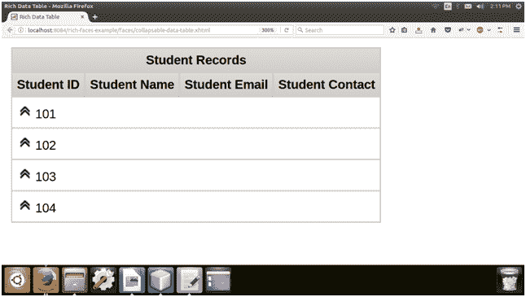
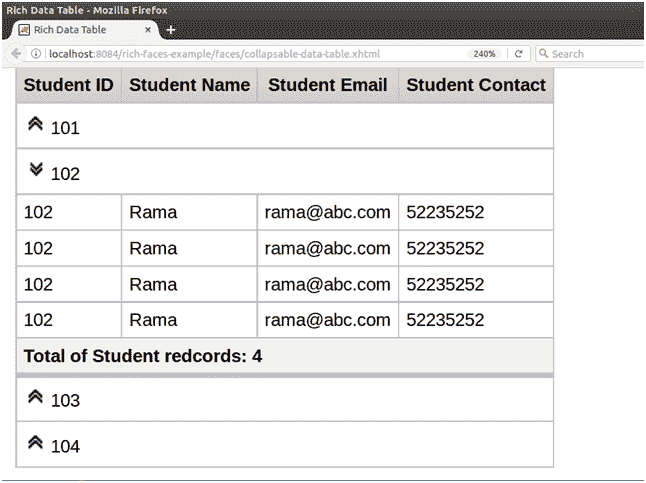

# richfaces〔t0〕

> 原文：<https://www.javatpoint.com/richfaces-rich-collapsiblesubtable>

这个组件充当了< **rich:dataTable** >的子元素。它遍历当前迭代对象中的子集合，以创建详细的表。

表格的详细部分可以折叠或展开。

<collapsiblesubtable>需要与<datatable>组件相同的基本属性。value 属性保存集合，var 属性指定迭代集合时要使用的变量。</datatable></collapsiblesubtable>

## 样式类

下表包含 collapsibleSubTable 的样式类和相应的外观参数。

| 班级 | 功能 | 皮肤参数 | 映射的 CSS 属性 |
| 。rf-cst | 它用于定义表格的样式。 | 没有皮肤参数。 |  |
| 。rf-cst-r | 它用于定义表格行的样式。 | 没有皮肤参数。 |  |
| 。rf-cst-fst-r | 它用于定义表格中第一行的样式。 | 没有皮肤参数。 |  |
| 。rf-cst-c | 它用于定义表格单元格的样式。 | tableBackgroundColor | 背景色 |
| . rf-cst-hdr | 它用于定义表格标题的样式。 | 没有皮肤参数。 |  |
| . rf-cst-hdr 弹性栏位 | 它用于定义第一个标题的样式。 | 没有皮肤参数。 |  |
| 。rf-cst-hdr-fst-r | 它用于定义标题中第一行的样式。 | 没有皮肤参数。 |  |
| . rf-cst-hdr-c | 它用于定义标题单元格的样式。 | tablesubheaderrbackgroundcolo | 背景色 |
| . rf-cst-shdr | 它用于定义表格子标题的样式。 | 没有皮肤参数。 |  |
| . RF-CST-shdr-fsdt | 它用于定义第一个子标题的样式。 | 没有皮肤参数。 |  |
| . rf-cst-shdr-c 型导弹 | 它用于定义子标题单元格的样式。 | tableSubHeaderBackgroundColor | 背景色 |
| 。rf-cst-ftr | 它用于定义表格页脚的样式。 | 没有皮肤参数。 |  |
| 。rf-cst-ftr 计划 | 它用于定义第一个页脚的样式。 | 没有皮肤参数。 |  |

* * *

## 例子

在下面的例子中，我们实现了<**rich:collapsibleSubTable**>组件。本示例包含以下文件。

### JSF 档案

**//可折叠-数据表. xhtml**

```java

<?xml version='1.0' encoding='UTF-8' ?>
<!DOCTYPE html PUBLIC "-//W3C//DTD XHTML 1.0 Transitional//EN""http://www.w3.org/TR/xhtml1/DTD/xhtml1-transitional.dtd">
<ui:composition 
xmlns:h="http://java.sun.com/jsf/html"
xmlns:f="http://java.sun.com/jsf/core"
xmlns:ui="http://java.sun.com/jsf/facelets"
xmlns:a4j="http://richfaces.org/a4j"
xmlns:rich="http://richfaces.org/rich">
<f:view>
<h:head>
<title>Rich Data Table</title>
</h:head>
<h:body>
<h:form>
<rich:dataTable value="#{studentRecord.records}" var="record">
<f:facet name="header">
<rich:columnGroup>
<rich:column colspan="6">
<h:outputText value="Student Records" />
</rich:column>
<rich:column breakRowBefore="true">
<h:outputText value="Student ID" />
</rich:column>
<rich:column>
<h:outputText value="Student Name" />
</rich:column>
<rich:column>
<h:outputText value="Student Email" />
</rich:column>
<rich:column>
<h:outputText value="Student Contact" />
</rich:column>
</rich:columnGroup>
</f:facet>
<rich:column colspan="6">
<rich:collapsibleSubTableToggler for="sbtbl" />
<h:outputText value="#{record.id}" />
</rich:column>
<rich:collapsibleSubTable value="#{record.records}" var="item" id="sbtbl" expandMode="client">
<rich:column>
<h:outputText value="#{record.id}" />
</rich:column>
<rich:column>
<h:outputText value="#{record.name}" />
</rich:column>
<rich:column>
<h:outputText value="#{record.email}" />
</rich:column>
<rich:column>
<h:outputText value="#{record.contactNumber}" />
</rich:column>
<f:facet name="footer">
<h:outputText value="Total of Student redcords: #{record.numberOfRecords}" />
</f:facet>
</rich:collapsibleSubTable>
</rich:dataTable>
</h:form>
</h:body>
</f:view>
</ui:composition>

```

### 托管 Bean

【t0///学生记录. Java”

```java

import java.util.ArrayList;
import java.util.List;
import javax.faces.bean.ManagedBean;
import javax.faces.bean.RequestScoped;
@ManagedBean
@RequestScoped
public class StudentRecord {
String id;
String name;
String email;
String contactNumber;
List<StudentRecord> records;
public StudentRecord(){}
public StudentRecord(String id, String name, String email, String contactNumber) {
this.id = id;
this.name = name;
this.email = email;
this.contactNumber = contactNumber;
}
public String getId() {
return id;
}
public void setId(String id) {
this.id = id;
}
public String getName() {
return name;
}
public void setName(String name) {
this.name = name;
}
public String getEmail() {
return email;
}
public void setEmail(String email) {
this.email = email;
}
public String getContactNumber() {
return contactNumber;
}
public void setContactNumber(String contactNumber) {
this.contactNumber = contactNumber;
}
public List<StudentRecord> getRecords() {
records = new ArrayList<>();
records.add(new StudentRecord("101", "Raju", "raju@abc.com", "52534252"));
records.add(new StudentRecord("102", "Rama", "rama@abc.com", "52235252"));
records.add(new StudentRecord("103", "John", "john@abc.com", "52456252"));
records.add(new StudentRecord("104", "Peter", "peter@abc.com", "55625252"));
return records;
}
public void setRecords(List<StudentRecord> records) {
this.records = records;
}
public int getNumberOfRecords(){
return this.records.size();
}
}

```

输出:



点击学生证后显示子表。



* * *