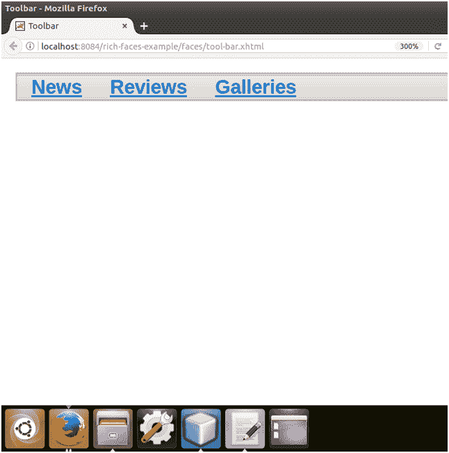

# richfaces〔t0〕

> 原文：<https://www.javatpoint.com/richfaces-rich-toolbar>

<toolbar>组件是一个水平工具栏。任何 JavaServer Faces)组件都可以添加到工具栏中。</toolbar>

<toolbar>组件不需要为基本用途定义任何属性。将子组件添加到<toolbar>组件，使它们在渲染时出现在工具栏上。</toolbar></toolbar>

## 样式类和外观参数

下表包含工具栏的样式类和相应的外观参数。

| 班级 | 功能 | 皮肤参数 | 映射的 CSS 属性 |
| 。rf-tb | 它用于定义工具栏本身的样式。 | panel bordercolor header textcolor | 边框颜色 |
| . RF-TB ITM | 它用于为工具栏中的项目定义样式。 | 没有皮肤参数。 |  |
| 。rf-tb-sep | 它用于定义工具栏中分隔符的样式。 | 没有皮肤参数。 |  |
| 。rf-tb-sep-grid，。rf-tb-sep-line，。rf-tb-sep-disc，。rf-tb-sep-square | 这些类定义了网格、线条、圆盘和方形分隔符的样式。 | 没有皮肤参数。 |  |
| . RF-TB CNT | 它用于定义工具栏容器的样式。 | 没有皮肤参数。 |  |

* * *

## 例子

这里，在下面的例子中，我们实现了< **rich:toolbar** >组件。本示例包含以下文件。

### JSF 档案

**//工具栏. xhtml**

```java

<ui:composition 
xmlns:h="http://java.sun.com/jsf/html"
xmlns:a4j="http://richfaces.org/a4j"
xmlns:rich="http://richfaces.org/rich"
xmlns:f="http://java.sun.com/jsf/core"
xmlns:ui="http://java.sun.com/jsf/facelets">
<f:view>
<h:head>
<title>Toolbar </title>
</h:head>
<h:body>
<h:form>
<rich:toolbar>
<h:commandLink value="News" />
<h:commandLink value="Reviews" />
<h:commandLink value="Galleries" />
</rich:toolbar>
</h:form>
</h:body>
</f:view>
</ui:composition>

```

输出:



* * *