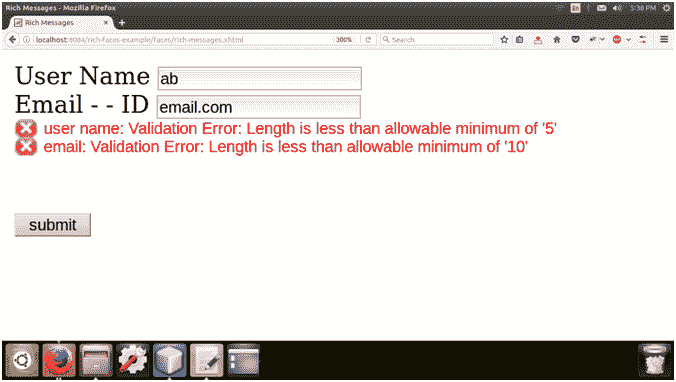

# richfaces〔t0〕

> 原文:[https://www.javatpoint.com/richfaces-rich-messages](https://www.javatpoint.com/richfaces-rich-messages)

该组件的工作方式类似于<message>组件，并在 Ajax 请求后自动呈现。用于集中显示当前网页的所有验证消息。</message>

基本用法不需要任何额外的属性。为了将消息限制到特定的组件，我们可以使用属性的**来引用该组件。**

## 样式类和外观参数

下表包含消息的样式类和相应的外观参数。

| 类别(选择器) | 功能 | 皮肤参数 | 映射的 CSS 属性 |
| . RF-msgid | 它用于定义消息本身的样式。 | 通用系列字体通用尺寸字体 | 字体系列字体大小 |
| . RF-msgid 错误 | 它用于定义错误消息的样式。 | 错误颜色 | 颜色 |
| 。rf-msgs-ftl | 它用于定义致命消息的样式。 | 错误颜色 | 颜色/td > |
| 。rf-msgs-inf | 它用于定义信息消息的样式。 | 常规文本颜色 | 颜色 |
| 。rf-msgs-wrn | 它用于定义警告消息的样式。 | 警告文本颜色 | 颜色 |
| . RF-msgs-确定 | 它用于定义基本 OK 消息的样式。 | 常规文本颜色 | 颜色 |
| 。rf-msgs-sum，。rf-msgs-det | 这些类定义了消息摘要或详细信息的样式。 | 没有皮肤参数。 |  |

* * *

## 例子

在下面的例子中，我们实现了< **rich:messages** >组件。本示例包含以下文件。

### JSF 档案

**//富消息. xhtml**

```java

<ui:composition 
xmlns:h="http://java.sun.com/jsf/html"
xmlns:a4j="http://richfaces.org/a4j"
xmlns:rich="http://richfaces.org/rich"
xmlns:f="http://java.sun.com/jsf/core"
xmlns:ui="http://java.sun.com/jsf/facelets">
<f:view>
<h:head>
<title>Rich Messages </title>
</h:head>
<h:body>
<h:form>
<h:outputText value="User Name " />
<h:inputText label="user name"
id="user-name"
required="true"
value="#{user.name}">
<f:validateLength minimum="5" maximum="20" />
</h:inputText><br/>
<h:outputText value="Email - - ID " />
<h:inputText label="email"
id="email"
required="true"
value="#{user.email}">
<f:validateLength minimum="10" maximum="50" />
</h:inputText>
<rich:messages/><br/><br/>
<h:commandButton value="submit"/>
</h:form>
</h:body>
</f:view>
</ui:composition>

```

### 托管 Bean

**//User.java**

```java

import javax.faces.bean.ManagedBean;
import javax.faces.bean.RequestScoped;
@ManagedBean
@RequestScoped
public class User {
String name;
String email;
public String getName() {
return name;
}
public void setName(String name) {
this.name = name;
}
public String getEmail() {
return email;
}
public void setEmail(String email) {
this.email = email;
}
}

```

输出:



* * *