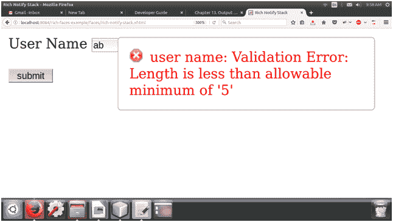

# richfaces〔t0〕

> 原文:[https://www.javatpoint.com/richfaces-rich-notifystack](https://www.javatpoint.com/richfaces-rich-notifystack)

该组件用于定义消息在网页上的位置。< **rich:notifyStack** >或<**rich:notify message**>显示的消息默认显示在网页右上角。

正是< **rich:notifyStack** >定义了消息将出现的位置。它还提供了从屏幕上删除消息的方法。

## 样式类和外观参数

下表包含 notifyStack 的样式类和相应的外观参数。

| 班级 | 功能 | 皮肤参数 | 映射的 CSS 属性 |
| . rf-ntf-pos-tl 型坦克 | 它用于定义左上角通知堆栈的位置。 | 没有皮肤参数。 |  |
| . RF-ntf pos-tr 型式 | 它用于定义通知的右上角堆栈的位置。 | 没有皮肤参数。 |  |
| . rf-ntf-pos-bl 型战斗机 | 它用于定义通知的左下角堆栈的位置。 | 没有皮肤参数。 |  |
| . rf-ntf 位置-br | 它用于定义通知右下角堆栈的位置。 | 没有皮肤参数。 |  |

* * *

## 示例:

这里，在下面的例子中，我们实现了< **rich:notify** >组件。本示例包含以下文件。

### JSF 档案

**//rich-notify-stack . XHTML**

```java
<ui:composition 
xmlns:h="http://java.sun.com/jsf/html"
xmlns:a4j="http://richfaces.org/a4j"
xmlns:rich="http://richfaces.org/rich"
xmlns:f="http://java.sun.com/jsf/core"
xmlns:ui="http://java.sun.com/jsf/facelets">
<f:view>
<h:head>
<title>Rich Notify Stack </title>
</h:head>
<h:body>
<h:form>
<h:outputText value="User Name " />
<h:inputText label="user name"
id="user-name"
required="true"
value="#{user.name}">
<f:validateLength minimum="5" maximum="20" />
</h:inputText><br/><br/>
<h:commandButton value="submit"/>
<rich:notifyStack position="topRight">
<rich:notifyMessage for="user-name"/>
</rich:notifyStack>
</h:form>
</h:body>
</f:view>
</ui:composition>

```

### 托管 Bean

**//User.java**

```java
import javax.faces.bean.ManagedBean;
import javax.faces.bean.RequestScoped;
@ManagedBean
@RequestScoped
public class User {
String name;
public String getName() {
return name;
}
public void setName(String name) {
this.name = name;
}
}

```

输出:



* * *