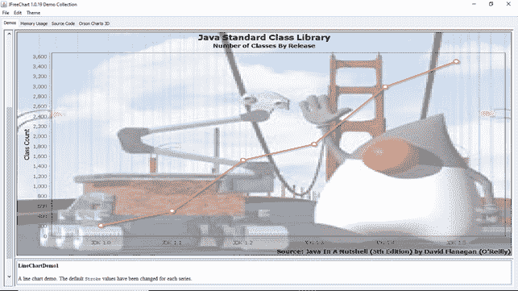
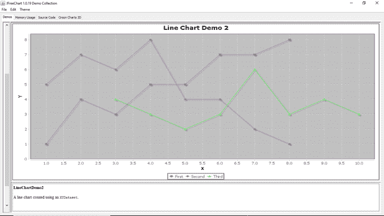
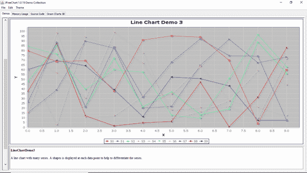
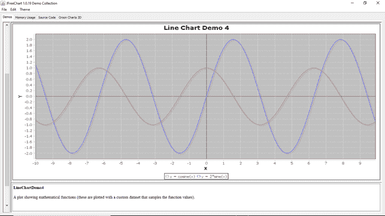
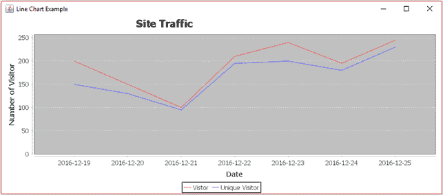

# 折线图-折线图

> 原文:[https://www.javatpoint.com/jfreechart-line-chart](https://www.javatpoint.com/jfreechart-line-chart)

折线图是由直线段连接的一系列点。信息通过这些相连的线显示出来。折线图表示数据如何以相同的时间频率变化。

下图显示了 JFreeChart 库中折线图的一些演示版本:

**折线图演示 1:**



**折线图演示 2:**



**折线图演示 3:**



**折线图演示 4:**



## 折线图示例

让我们考虑一个样本数据，它显示了我们网站[www.javaTpoint.com 的频繁流量。](https://www.javatpoint.com/)

| 日期 | 每日访客总数 |
| 2016-12-19 | Two hundred |
| 2016-12-20 | One hundred and fifty |
| 2016-12-21 | One hundred |
| 2016-12-22 | Two hundred and ten |
| 2016-12-23 | Two hundred and forty |
| 2016-12-24 | One hundred and ninety-five |
| 2016-12-25 | Two hundred and forty-five |

| 日期 | 独特访客总数 |
| 2016-12-19 | One hundred and fifty |
| 2016-12-20 | One hundred and thirty |
| 2016-12-21 | Ninety-five |
| 2016-12-22 | One hundred and ninety-five |
| 2016-12-23 | Two hundred |
| 2016-12-24 | one hundred and eighty  |
| 2016-12-25 | Two hundred and thirty |

以下代码根据上述示例数据创建了一个折线图:

## LineChartExample.java

```java

import javax.swing.JFrame;
import javax.swing.SwingUtilities;

import org.jfree.chart.ChartFactory;
import org.jfree.chart.ChartPanel;
import org.jfree.chart.JFreeChart;
import org.jfree.data.category.DefaultCategoryDataset;

public class LineChartExample extends JFrame {

  private static final long serialVersionUID = 1L;

  public LineChartExample(String title) {
    super(title);
    // Create dataset
    DefaultCategoryDataset dataset = createDataset();
    // Create chart
    JFreeChart chart = ChartFactory.createLineChart(
        "Site Traffic", // Chart title
        "Date", // X-Axis Label
        "Number of Visitor", // Y-Axis Label
        dataset
        );

    ChartPanel panel = new ChartPanel(chart);
    setContentPane(panel);
  }

  private DefaultCategoryDataset createDataset() {

    String series1 = "Visitor";
    String series2 = "Unique Visitor";

    DefaultCategoryDataset dataset = new DefaultCategoryDataset();

    dataset.addValue(200, series1, "2016-12-19");
    dataset.addValue(150, series1, "2016-12-20");
    dataset.addValue(100, series1, "2016-12-21");
    dataset.addValue(210, series1, "2016-12-22");
    dataset.addValue(240, series1, "2016-12-23");
    dataset.addValue(195, series1, "2016-12-24");
    dataset.addValue(245, series1, "2016-12-25");

    dataset.addValue(150, series2, "2016-12-19");
    dataset.addValue(130, series2, "2016-12-20");
    dataset.addValue(95, series2, "2016-12-21");
    dataset.addValue(195, series2, "2016-12-22");
    dataset.addValue(200, series2, "2016-12-23");
    dataset.addValue(180, series2, "2016-12-24");
    dataset.addValue(230, series2, "2016-12-25");

    return dataset;
  }

  public static void main(String[] args) {
    SwingUtilities.invokeLater(() -> {
      LineChartExample example = new LineChartExample("Line Chart Example");
      example.setAlwaysOnTop(true);
      example.pack();
      example.setSize(600, 400);
      example.setDefaultCloseOperation(WindowConstants.EXIT_ON_CLOSE);
      example.setVisible(true);
    });
  }
}

```

**输出:**

