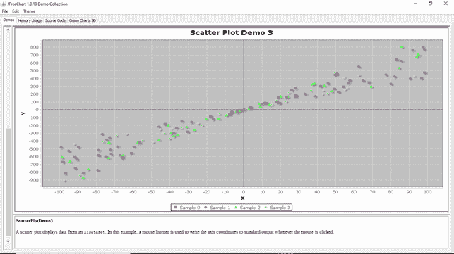

# 散点图

> 原文:[https://www.javatpoint.com/jfreechart-scatter-chart](https://www.javatpoint.com/jfreechart-scatter-chart)

散点图或曲线图包含一组绘制在水平轴和垂直轴上的数据点。它显示来自 XYDataset 的数据。

以下图像显示了 JFreeChart 库中包含的散点图的一些演示版本:

**散点图演示 1:**


**散点图演示 2:**


**散点图演示 3:**



## 散点图示例:

让我们考虑散点图的以下样本数据。

| 男孩(系列 1) | 女孩(系列 2) |
| 年龄 | 重量 | 年龄 | 重量 |
| one | Seventy-two point nine | one | Seventy-two point five |
| Two | Eighty-one point six | Two | Eighty point one |
| three | Eighty-eight point nine | three | Eighty-seven point two |
| four | Ninety-six | four | Ninety-four point five |
| five | One hundred and two point one | five | One hundred and one point four |
| six | One hundred and eight point five | six | One hundred and seven point four |
| seven | One hundred and thirteen point nine | seven | One hundred and twelve point eight |
| eight | One hundred and nineteen point three | eight | One hundred and eighteen point two |
| nine | One hundred and twenty-three point eight | nine | One hundred and twenty-two point nine |
| Ten | One hundred and twenty-four point four | Ten | One hundred and twenty-three point four |

以下代码根据上述样本数据创建散点图:

## ScatterPlotExample.java

```java

import java.awt.Color;
import javax.swing.JFrame;
import javax.swing.SwingUtilities;
import javax.swing.WindowConstants;
import org.jfree.chart.ChartFactory;
import org.jfree.chart.ChartPanel;
import org.jfree.chart.JFreeChart;
import org.jfree.chart.plot.XYPlot;
import org.jfree.data.xy.XYDataset;
import org.jfree.data.xy.XYSeries;
import org.jfree.data.xy.XYSeriesCollection;

public class ScatterPlotExample extends JFrame {
  private static final long serialVersionUID = 6294689542092367723L;

  public ScatterPlotExample(String title) {
    super(title);

    // Create dataset
    XYDataset dataset = createDataset();

    // Create chart
    JFreeChart chart = ChartFactory.createScatterPlot(
        "Boys VS Girls weight comparison chart", 
        "X-Axis", "Y-Axis", dataset);

    //Changes background color
    XYPlot plot = (XYPlot)chart.getPlot();
    plot.setBackgroundPaint(new Color(255,228,196));

    // Create Panel
    ChartPanel panel = new ChartPanel(chart);
    setContentPane(panel);
  }

  private XYDataset createDataset() {
    XYSeriesCollection dataset = new XYSeriesCollection();

    //Boys (Age,weight) series
    XYSeries series1 = new XYSeries("Boys");
    series1.add(1, 72.9);
    series1.add(2, 81.6);
    series1.add(3, 88.9);
    series1.add(4, 96);
    series1.add(5, 102.1);
    series1.add(6, 108.5);
    series1.add(7, 113.9);
    series1.add(8, 119.3);
    series1.add(9, 123.8);
    series1.add(10, 124.4);

    dataset.addSeries(series1);

   //Girls (Age,weight) series
    XYSeries series2 = new XYSeries("Girls");
    series2.add(1, 72.5);
    series2.add(2, 80.1);
    series2.add(3, 87.2);
    series2.add(4, 94.5);
    series2.add(5, 101.4);
    series2.add(6, 107.4);
    series2.add(7, 112.8);
    series2.add(8, 118.2);
    series2.add(9, 122.9);
    series2.add(10, 123.4);

    dataset.addSeries(series2);

    return dataset;
  }

  public static void main(String[] args) {
    SwingUtilities.invokeLater(() -> {
      ScatterPlotExample example = new ScatterPlotExample("Scatter Chart Example");
      example.setSize(800, 400);
      example.setLocationRelativeTo(null);
      example.setDefaultCloseOperation(WindowConstants.EXIT_ON_CLOSE);
      example.setVisible(true);
    });
  }
}

```

**输出:**

