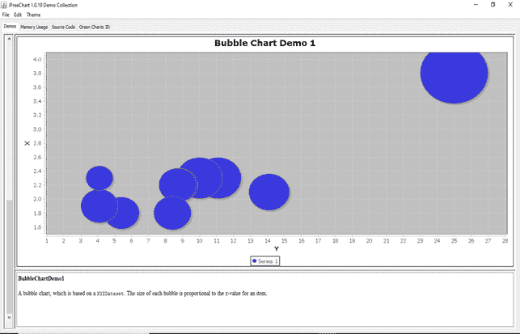
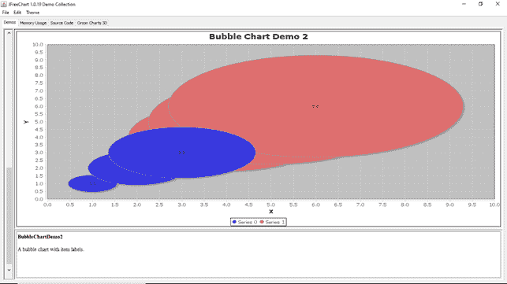
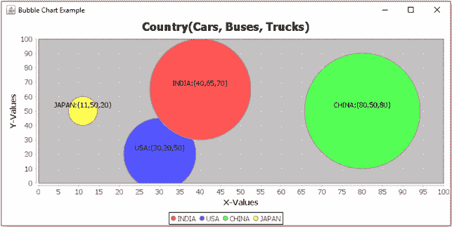

# JFreeChart-气泡图

> 原文：<https://www.javatpoint.com/jfreechart-bubble-chart>

气泡图以三维方式表示信息。此图表是散点图(XY 图表)的变体，其中数据点由气泡代替，数据的额外维度(z 值)以气泡的大小表示。

以下图像显示了包含在 JFreeChart 库中的气泡图的一些演示版本:

**气泡图演示 1:**



**气泡图演示 2:**



## 气泡图示例:

让我们考虑以下气泡图的样本数据。

| 国家 | 汽车(百万)X 值 | 总线(百万)Y 值 | 卡车(百万)Z 值 |
| 印度 | Forty | Sixty-five | Seventy |
| 单位美国 | Thirty | Twenty | Fifty |
| 中国 | Eighty | Fifty | Eighty |
| 日本 | Eleven | Fifty | Twenty |

以下代码根据上述示例数据创建气泡图:

## BubbleChartExample.java

```java

import java.text.DecimalFormat;
import javax.swing.JFrame;
import javax.swing.SwingUtilities;
import javax.swing.WindowConstants;
import org.jfree.chart.ChartFactory;
import org.jfree.chart.ChartPanel;
import org.jfree.chart.JFreeChart;
import org.jfree.chart.axis.NumberAxis;
import org.jfree.chart.labels.BubbleXYItemLabelGenerator;
import org.jfree.chart.plot.XYPlot;
import org.jfree.chart.renderer.xy.XYBubbleRenderer;
import org.jfree.data.xy.DefaultXYZDataset;
import org.jfree.data.xy.XYZDataset;

public class BubbleChartExample extends JFrame {

  private static final long serialVersionUID = 1L;

  public BubbleChartExample(String title) {
    super(title);

    // Create dataset
    XYZDataset dataset = createDataset();

    // Create chart
    JFreeChart chart = ChartFactory.createBubbleChart(
        "Country(Cars, Buses, Trucks)", 
        "X-Values", 
        "Y-Values", dataset);

    // Set range for X-Axis
    XYPlot plot = chart.getXYPlot();
    NumberAxis domain = (NumberAxis) plot.getDomainAxis();
    domain.setRange(0, 100);

    // Set range for Y-Axis
    NumberAxis range = (NumberAxis) plot.getRangeAxis();
    range.setRange(0, 100);

    //Format label
    XYBubbleRenderer renderer=(XYBubbleRenderer)plot.getRenderer();
    BubbleXYItemLabelGenerator generator=new BubbleXYItemLabelGenerator(
        " {0}:({1},{2},{3}) ",new DecimalFormat("0"),
        new DecimalFormat("0"),
        new DecimalFormat("0"));
    renderer.setBaseItemLabelGenerator(generator);
    renderer.setBaseItemLabelsVisible(true);

    // Create Panel
    ChartPanel panel = new ChartPanel(chart);
    setContentPane(panel);
  }
  private XYZDataset createDataset() {
    DefaultXYZDataset dataset = new DefaultXYZDataset();

    dataset.addSeries("INDIA", new double[][] { 
      { 40 }, // X-Value 
      { 65 }, // Y-Value 
      { 70 }  // Z-Value 
     });
    dataset.addSeries("USA", new double[][] { { 30 }, { 20 }, { 50 } });
    dataset.addSeries("CHINA", new double[][] { { 80 }, { 50 }, { 80 } });
    dataset.addSeries("JAPAN", new double[][] { { 11 }, { 50 }, { 20 } });

    return dataset;
  }

  public static void main(String[] args) {
    SwingUtilities.invokeLater(() -> {
      BubbleChartExample example = new BubbleChartExample("Bubble Chart Example");
      example.setSize(800, 400);
      example.setLocationRelativeTo(null);
      example.setDefaultCloseOperation(WindowConstants.EXIT_ON_CLOSE);
      example.setVisible(true);
    });
  }
}

```

**输出:**

