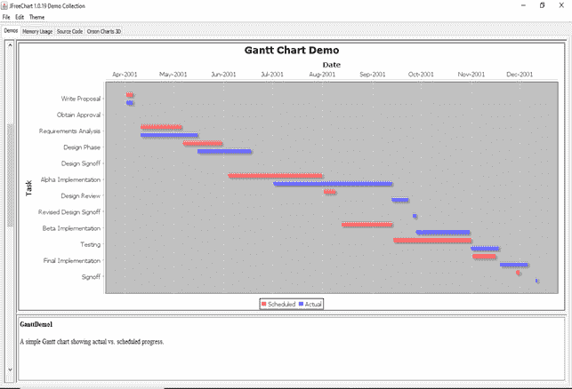

# 甘特图-甘特图

> 原文：<https://www.javatpoint.com/jfreechart-gantt-chart>

甘特图是一种条形图，通常用于计划和安排项目任务和事件。

以下图像显示了 JFreeChart 库中包含的甘特图的一些演示版本:

**甘特图演示 1:**



**甘特图演示 2:**


## 甘特图示例:

让我们考虑下面的甘特图示例数据。

| 软件开发阶段 | 预计日期 | 实际日期 |
| 要求 | 2017-07-03 | 2017-07-07 | 2017-07-03 | 2017-07-05 |
| 设计 | 2017-07-10 | 2017-07-14 | 2017-07-06 | 2017-07-17 |
| 编码 | 2017-07-17 | 2017-07-21 | 2017-07-18 | 2017-07-27 |
| 测试 | 2017-07-24 | 2017-07-28 | 2017-07-28 | 2017-08-01 |
| 部署 | 2017-07-31 | 2017-08-04 | 2017-08-02 | 2017-08-04 |

以下代码根据上述示例数据创建甘特图:

## GanttChartExample.java

```java
import java.time.LocalDate;
import java.time.ZoneOffset;
import java.util.Date;
import javax.swing.JFrame;
import javax.swing.SwingUtilities;
import javax.swing.WindowConstants;
import org.jfree.chart.ChartFactory;
import org.jfree.chart.ChartPanel;
import org.jfree.chart.JFreeChart;
import org.jfree.data.category.IntervalCategoryDataset;
import org.jfree.data.gantt.Task;
import org.jfree.data.gantt.TaskSeries;
import org.jfree.data.gantt.TaskSeriesCollection;

public class GanttChartExample extends JFrame {

   private static final long serialVersionUID = 1L;

   public GanttChartExample(String title) {
      super(title);
      // Create dataset
      IntervalCategoryDataset dataset = getCategoryDataset();

      // Create chart
      JFreeChart chart = ChartFactory.createGanttChart(
            "Gantt Chart Example", // Chart title
            "Software Development Phases", // X-Axis Label
            "Timeline", // Y-Axis Label
            dataset);

      ChartPanel panel = new ChartPanel(chart);
      setContentPane(panel);
   }

   private IntervalCategoryDataset getCategoryDataset() {

TaskSeries series1 = new TaskSeries("Estimated Date"); series1.add(new Task("Requirement",
Date.from(LocalDate.of(2017,7,3).atStartOfDay().toInstant(ZoneOffset.UTC)),
Date.from(LocalDate.of(2017, 7,7).atStartOfDay().toInstant(ZoneOffset.UTC))
         ));

 series1.add(new Task("Design",Date.from(LocalDate.of(2017, 7,10).atStartOfDay().toInstant(ZoneOffset.UTC)),
 Date.from(LocalDate.of(2017, 7, 14).atStartOfDay().toInstant(ZoneOffset.UTC))
         ));

 series1.add(new Task("Coding",Date.from(LocalDate.of(2017, 7,17).atStartOfDay().toInstant(ZoneOffset.UTC)),
 Date.from(LocalDate.of(2017, 7, 21).atStartOfDay().toInstant(ZoneOffset.UTC))
         ));

 series1.add(new Task("Testing", Date.from(LocalDate.of(2017, 7,24).atStartOfDay().toInstant(ZoneOffset.UTC)),
 Date.from(LocalDate.of(2017, 7, 28).atStartOfDay().toInstant(ZoneOffset.UTC))
         ));

 series1.add(new Task("Deployment", Date.from(LocalDate.of(2017, 07,31).atStartOfDay().toInstant(ZoneOffset.UTC)),
 Date.from(LocalDate.of(2017, 8, 4).atStartOfDay().toInstant(ZoneOffset.UTC))
         ));

TaskSeries series2 = new TaskSeries("Actual Date");
series2.add(new Task("Requirement",Date.from(LocalDate.of(2017, 7,3).atStartOfDay().toInstant(ZoneOffset.UTC)),
Date.from(LocalDate.of(2017, 7, 05).atStartOfDay().toInstant(ZoneOffset.UTC))
         ));

 series2.add(new Task("Design",
 Date.from(LocalDate.of(2017, 7, 6).atStartOfDay().toInstant(ZoneOffset.UTC)),
 Date.from(LocalDate.of(2017, 7, 17).atStartOfDay().toInstant(ZoneOffset.UTC))
         ));

 series2.add(new Task("Coding",
 Date.from(LocalDate.of(2017, 7, 18).atStartOfDay().toInstant(ZoneOffset.UTC)),
 Date.from(LocalDate.of(2017, 7, 27).atStartOfDay().toInstant(ZoneOffset.UTC))
         ));

 series2.add(new Task("Testing",
 Date.from(LocalDate.of(2017, 7, 28).atStartOfDay().toInstant(ZoneOffset.UTC)),
 Date.from(LocalDate.of(2017, 8, 1).atStartOfDay().toInstant(ZoneOffset.UTC))
         ));

 series2.add(new Task("Deployment",
 Date.from(LocalDate.of(2017, 8, 2).atStartOfDay().toInstant(ZoneOffset.UTC)),
 Date.from(LocalDate.of(2017, 8, 4).atStartOfDay().toInstant(ZoneOffset.UTC))
         ));

 TaskSeriesCollection dataset = new TaskSeriesCollection();
 dataset.add(series1);dataset.add(series2);
 return dataset;
   }

 public static void main(String[] args) {
 SwingUtilities.invokeLater(() -> {
 GanttChartExample example = new GanttChartExample("Gantt Chart Example");
         example.setSize(800, 400);
         example.setLocationRelativeTo(null);
         example.setDefaultCloseOperation(WindowConstants.EXIT_ON_CLOSE);
         example.setVisible(true);
      });
   }
}

```

**输出:**

