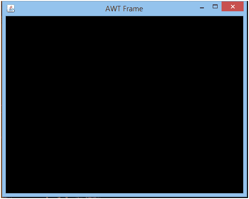

# 使用 AWT 的 JOGL 框架

> 原文:[https://www.javatpoint.com/jogl-frame-using-awt](https://www.javatpoint.com/jogl-frame-using-awt)

AWT(抽象窗口工具包)是一个应用程序编程接口，用于开发基于窗口的应用程序。AWT 提供的组件重量很大，并且依赖于平台。 **java.awt** 包包含各种用于 API 的 awt 类。

AWT(抽象窗口工具包)是一个应用程序编程接口，用于开发基于窗口的应用程序。AWT 提供的组件重量很大，并且依赖于平台。 **java.awt** 包包含各种用于 API 的 awt 类。

现在，我们将使用 JOGL 的类和 AWT 通过以下步骤创建一个简单的框架:-

*   遵循上一页讨论的 JOGL 的基本结构。
*   使用 AWT 的框架类创建一个框架。要使用这个类，需要导入 java.awt 包。

```java

Frame frame = new Frame ("AWT Frame");

```

*   现在，使用 add()方法用 Frame 类对象添加 GLCanvas 类的对象。

```java

frame.add(gc);

```

*   在 setSize()方法中提供所需的尺寸，并使框架可见。

```java

frame.setSize( 500, 400 );
frame.setVisible(true);

```

## JOGL 框架示例

在这个例子中，我们将使用 AWT 创建一个简单的 JOGL 帧。

**awtfframe . Java**

```java

package com.javatpoint.jogl;
import java.awt.Frame;
import javax.media.opengl.*;
import javax.media.opengl.awt.GLCanvas;

public class AWTFrame implements GLEventListener {

   @Override
	public void init(GLAutoDrawable obj) {

	   }

   @Override
public void display(GLAutoDrawable obj) {

   }

   @Override
public void reshape(GLAutoDrawable obj1, int obj2, int obj3, int obj4, int obj5) {

   }

   @Override
public void dispose(GLAutoDrawable obj) {

   }

public static void main(String[] args) {

final GLProfile gp = GLProfile.get(GLProfile.GL4);
GLCapabilities cap = new GLCapabilities(gp);

final GLCanvas gc = new GLCanvas(cap);
AWTFrame af = new AWTFrame();
gc.addGLEventListener(af);        
gc.setSize(350, 350);

      //Now creating a frame using Frame class of AWT
final Frame frame = new Frame ("AWT Frame");

frame.add(gc);
frame.setSize( 500, 400 );
frame.setVisible(true);
   }

}

```

**输出:**

