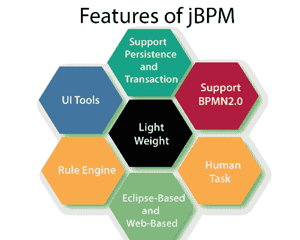

# jBPM 特性

> 原文:[https://www.javatpoint.com/jbpm-features](https://www.javatpoint.com/jbpm-features)

## jBPM 的核心特性是:

*   重量轻
*   支持 BPMN 2.0
*   支持持久性和事务
*   用户界面工具
*   基于 Eclipse 和基于网络的
*   规则引擎
*   人工任务服务

### 重量轻

jBPM 是轻量级的、完全开源的，并且是用 Java 语言编写的。

### 支持 BPMN 2.0

jBPM 关注 **BPMN 2.0** (业务流程模型和通知)规范作为流程定义语言。 **BPMN 2.0** 是流程建模的全球标准，也是成功的业务-信息技术-协调的核心组成部分之一。

### 持久性和事务

jBPM 支持基于 **JPA** 和 **JTA** 的持久性和事务。

### 用户界面工具

jBPM 在设计阶段有 UI 工具可用。

### 基于 Eclipse 和基于网络的

jBPM 在基于 **Eclipse 的**和基于 **Web 的**编辑器上工作，该编辑器为我们的业务流程的图形创建和模拟提供**拖动**和**拖放**支持。

### 规则引擎

jBPM 提供了一个**规则引擎**，它提供了一种声明性语言，用于评估可用的信息。

### 人工任务服务

jBPM 使用基于 **Web 服务人工任务**规范的可插拔人工任务服务。它包括需要由人类执行的任务。它还定义了存储人工任务信息的数据结构。