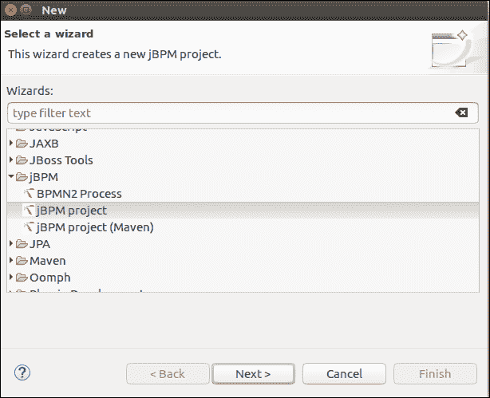
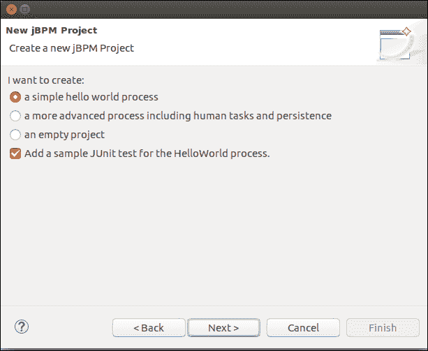
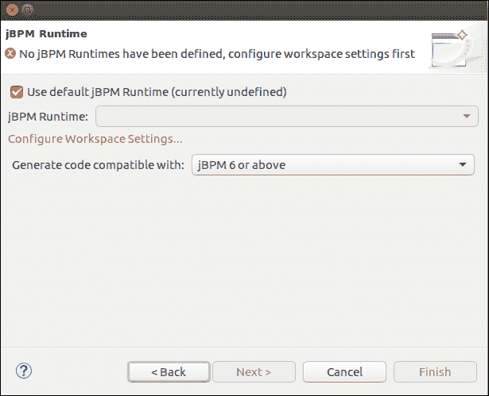
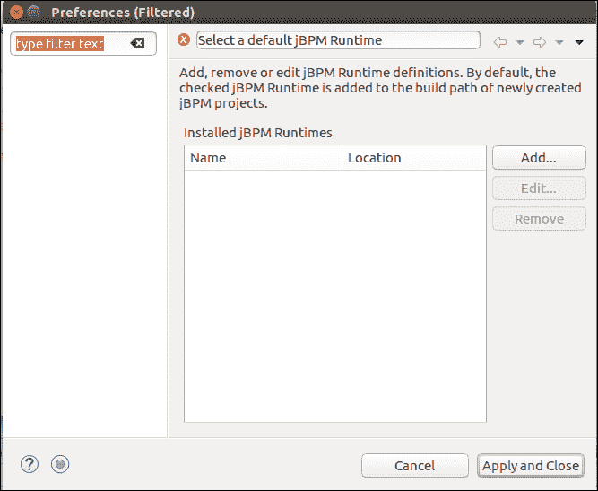
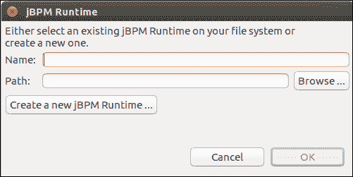
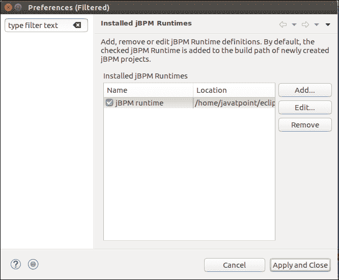
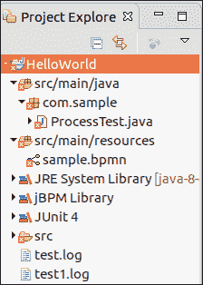
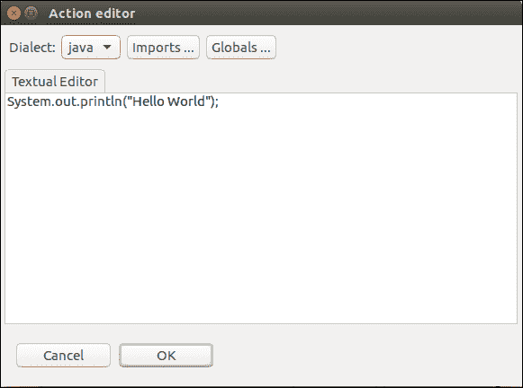
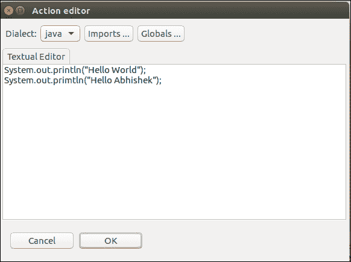

# 你好世界示例

> 原文:[https://www.javatpoint.com/jbpm-hello-world-example](https://www.javatpoint.com/jbpm-hello-world-example)

在这里，我们将编写我们的第一个应用程序 **jbpm** 。我们必须遵循以下步骤来创建我们的第一个应用程序。

### 创建项目

创建项目转到**文件- >新建- >其他- > jBPM 项目**。

### 2.提供项目名称

点击下一步，输入我们的项目名称**“hello world”**。

3.我们在项目中包含了一个示例流程来开始。见下图，点击**下一步**。

### 4.选择 jBPM 运行时

点击**配置工作空间设置**。

5.新窗口屏幕将被打开，点击**添加**按钮。

一旦点击**添加**按钮，一个新的窗口屏幕将会打开。在这个窗口中点击**“创建一个新的 jBPM 运行时”**。

新屏幕将再次打开。给出 **jBPM 运行时**的路径，选择**已安装的 jBPM 运行时**点击**应用并关闭**按钮。

**6。完成项目**

## 项目结构

现在在**月食**中打开**项目浏览器**视图。我们将看到以下屏幕。

双击项目的 **sample.bpmn** ，我们会看到如下画面。

这里的**绿色**圆圈表示工作流的**开始**，红色圆圈表示工作流的**结束**。开始和结束事件之间的**你好**是**脚本任务**。

要查看脚本任务**中写的代码你好**，然后转到**窗口- >显示视图- >其他- >属性**。我们将看到下面的屏幕。

点击**打开**按钮。选择**你好**并查看**你好**事件的属性。

要查看在 **Hello** 事件点击动作属性中编写的整个代码，将出现新的屏幕。

我们也可以**编辑**这个，并在**你好**事件脚本任务中编写我们想要执行的代码。让我们**编辑**并查看输出。

**输出:**

