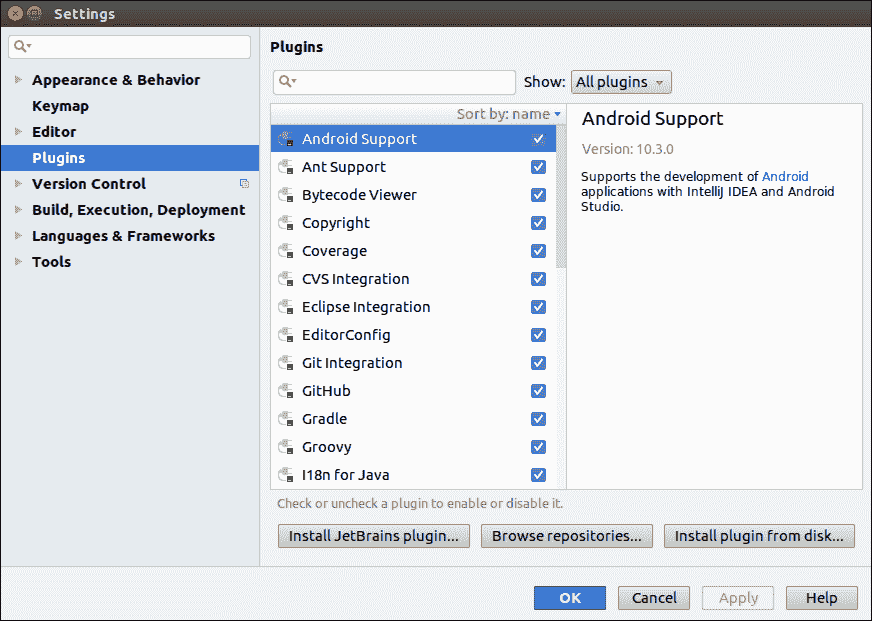

# 智能想法插件

> 原文:[https://www.javatpoint.com/intellij-idea-plugins](https://www.javatpoint.com/intellij-idea-plugins)

插件是一种向现有应用程序添加特定功能的软件。在 IntelliJ IDEA 中，插件是其核心功能的扩展。更多的插件为我们的应用程序提供了更多的功能，但这对性能没有好处。安装在集成开发环境中的插件越多，集成开发环境的性能就越低。

## 插件安装

1.  转到**文件- >设置- >插件**。窗口屏幕在下面打开。
2.  在这个窗口中，我们可以看到集成开发环境中安装的所有插件。我们可以启用或禁用所需插件前面的复选框。

### 插件的类别

在 IntelliJ IDEA 中，插件可以分为以下几类:

1.  **插件捆绑**。它附带了集成开发环境。默认情况下，它们已安装并启用。
2.  **插件库**。我们可以通过分别下载和安装它们来使用这个插件库。

### 下载并安装存储库插件

1.转到文件->设置->插件。一扇窗户会打开。

2.单击安装喷气大脑插件或浏览存储库按钮。新窗口将会打开。

3.右键单击所需插件，然后选择下载并安装。

4.确认对话框打开，安装选定的插件。

5.关闭然后重新启动智能集成开发环境。