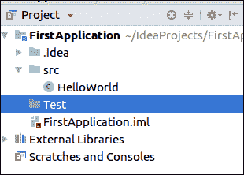
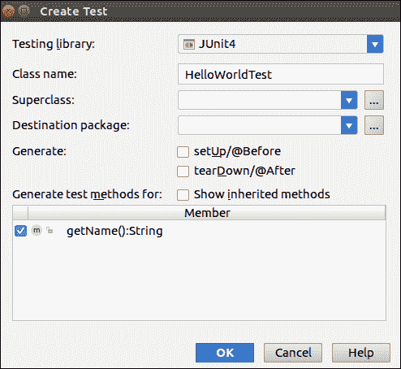

# 智能理念单元测试

> 原文：<https://www.javatpoint.com/intellij-idea-unit-test>

我们可以在 IntelliJ IDEA 中运行所有的单元测试。IntelliJ IDEA 有各种单元测试框架，比如 JUnit、TestNG 等等。在本节中，我们将了解单元测试是如何工作的。在这里，我们将使用 JUnit 4:

## 创建单元测试

按照下面给出的步骤创建单元测试:

**1。创建项目**

2.在 src 文件夹中，创建一个 **Java 类文件**，并输入以下代码。

```java

public class HelloWorld {
    private String name;
    public HelloWorld(String name) {
        this.name = name;
    }
    public String getName() {
        return name;
    }
}

```

3.创建一个名为**测试**的**新目录**来执行单元测试。


4.现在我们的**项目结构**会是这样的。



5.转到**文件- >项目结构- >模块**。将会打开一个新的窗口屏幕。在**源**菜单中选择**测试**目录进行测试，然后点击**确定**按钮。


6.转到**导航- >测试**。将出现一个对话框。

7.点击**新建测试**。一个新的窗口将会打开。填写窗口中给出的详细信息。点击**确定**按钮。



8.新的**HelloWorldTest.java**文件将打开。在这个文件中，我们必须键入以下代码。

```java

public class HelloWorldTest {
    @Test
    public void getName() throws Exception {
        HelloWorld john = new HelloWorld("John");
        assertEquals("John",john.getName());
    }
}

```

9.现在点击**运行**。我们可以在编辑器的底部看到生成的结果。

