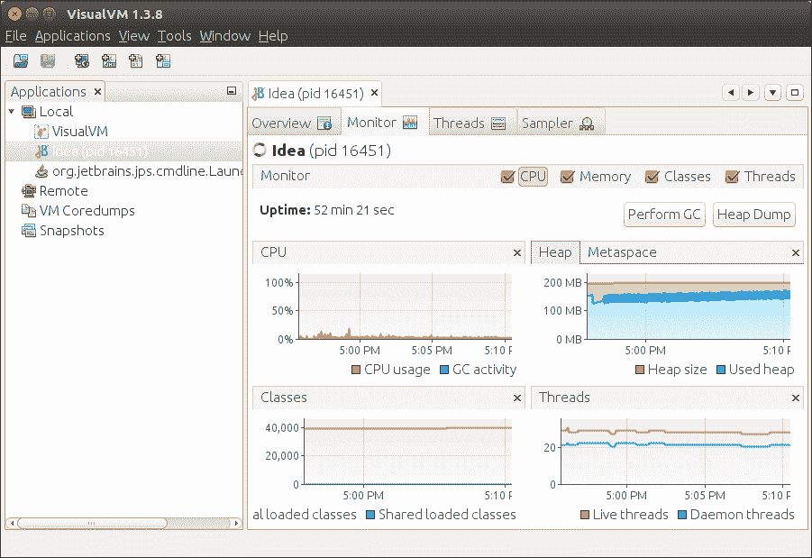
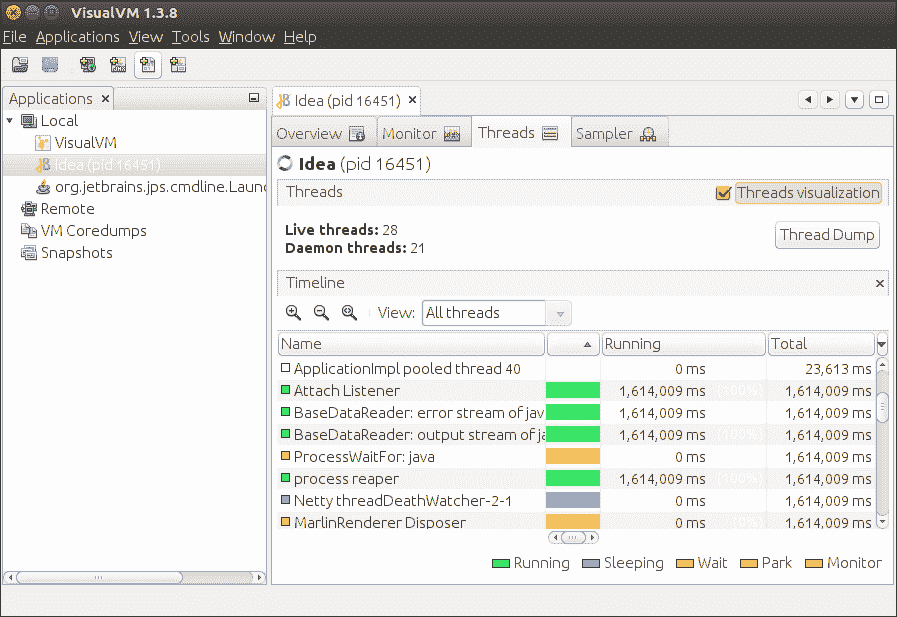
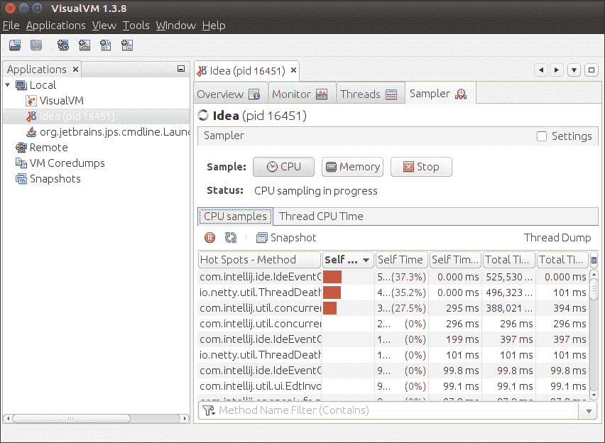
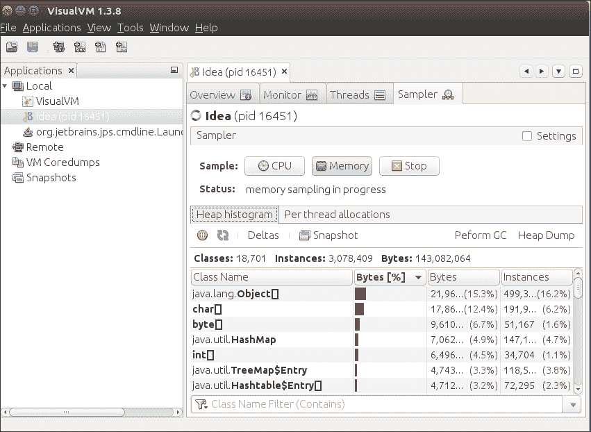

# IntelliJ IDEA Profiler

> 原文:[https://www.javatpoint.com/intellij-idea-profiler](https://www.javatpoint.com/intellij-idea-profiler)

Profiler 提供了关于应用程序性能的准确信息。它测量应用程序的 CPU、内存和堆使用的性能。它还为我们提供了关于应用程序线程的详细信息。VisualVM 工具用于测量 Java 应用程序的概要分析。

## 什么是 VisualVM？

这是一个可视化工具，已经与 Java 6 或更高版本的 JDK 捆绑在一起。它对初学者很好，并给出了关于我们应用程序性能的详细信息。

## 配置

### 在窗口中

1.  下载 **VisualVM** 。要下载 [**点击这里**](https://visualvm.github.io/download.html) 。
2.  提取下载的 **Zip** 文件。
3.  在提取的文件中，转到 **etc/visualvm.conf** 文件。检查以下行**visualvm _ JDK home =“<path of="" jdk="">”</path>T5】**
4.  如果安装了 Jdk，那么应该是这样的**visualvm _ Jdk home =“C:\ Program file \ Java \ Jdk-8 . 0 . 1”**

### 在 Linux 中

要安装 **VisualVM** ，在终端中键入以下内容:

1.  $ sudo apt-get 安装默认值-jdk。
2.  $ sudo apt install visualvm。
3.  要打开 VisualVM，请键入 **$ visualvm** 。

## 监控应用程序

1.  开放式〔t0〕可视目标〔t1〕。
2.  在左窗格中选择**应用程序**。
3.  选择**监视器**选项卡。

我们可以在这里看到 CPU、堆、类和线程的使用情况。我们还可以通过将鼠标悬停在任何图形上来查看具体用法。

## 螺纹测量

每个 Java 应用程序都有多个线程。我们可以在 VisualVM 工具中看到关于线程的详细信息。选择**线程**选项卡，它会显示我们的应用线程的各种统计数据，如**活动线程**和**守护线程**的数量。我们可以在下图中看到**运行、睡眠、等待、停车、监控**线程显示给我们。

## 抽样应用

可视化虚拟机为我们提供了中央处理器、内存采样和内存泄漏的信息。要进行采样，请选择应用程序，然后选择采样器选项卡。**采样器**标签有三个子标签-:中央处理器标签、内存标签和停止点击。

## 中央处理器采样

要进行中央处理器采样，点击**中央处理器按钮**。将出现以下截图。

## 记忆取样

要进行记忆采样，点击**记忆按钮**。将出现以下截图。

## 内存泄漏

内存泄漏是指某些对象不再在应用程序中使用，而垃圾收集器无法将它们识别为未使用。在程序运行期间，它用程序中没有使用的对象填充堆区域。当内存空间由于不必要的对象存储而满了时，我们可以理解为内存泄漏的迹象。